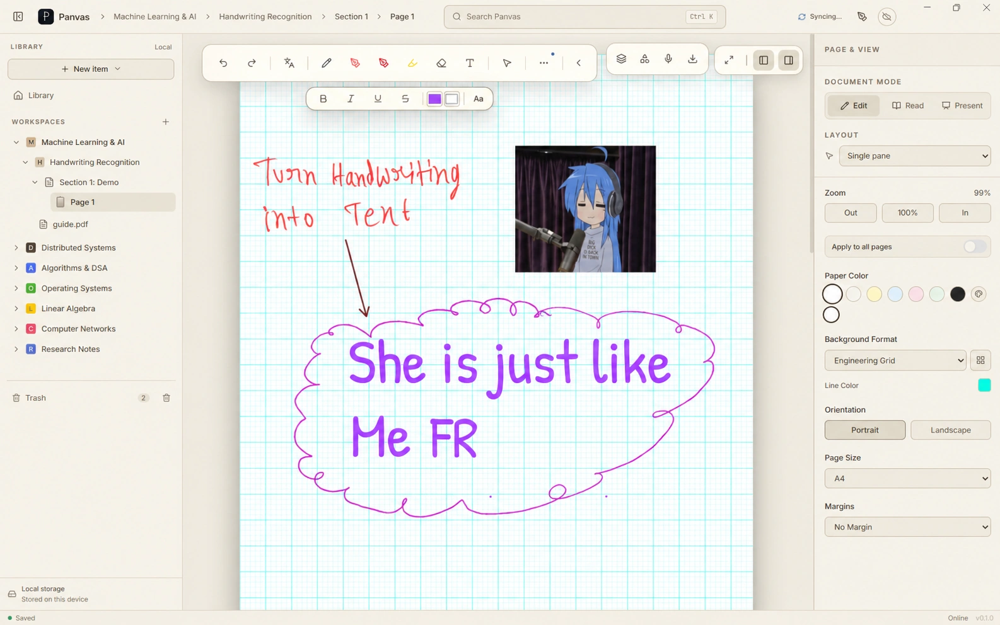
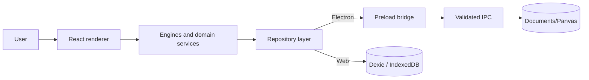

# Panvas

Panvas is a local-first visual workspace for notes, handwriting, PDFs, and spatial thinking.



Panvas combines a structured notebook with a free-form canvas. The Windows desktop build keeps the workspace on disk; the web build uses browser-local storage. Panvas is MIT licensed.

## What ships in v0.1.0

### Structured notebooks

Workspaces contain folders, notebooks, sections, and pages:

```text
Workspace -> Folder -> Notebook -> Section -> Page
```

Notebook pages support rich text, vector ink, pressure-aware pen input, smoothing, erasing, a ruler, paper templates, sticky notes, layers, images, and voice notes.

### Documents and visual thinking

- Import and read PDFs with PDF.js, annotate them with vector ink, and export annotated PDFs.
- Open an Excalidraw-powered infinite canvas for diagrams, shapes, text, images, sticky notes, and Panvas custom blocks.
- Search local titles and document content, restore items from trash, and export/import workspace backups.

### Local-first storage

- Windows Electron stores workspace JSON and binary assets under `Documents/Panvas/` by default. A different storage root can be selected in settings.
- The browser build stores records in origin-scoped Dexie/IndexedDB. Browser data is subject to the browser's quota and clearing policies.
- Cloud Sync is release-gated and disabled by default. A build must explicitly enable the cloud flags before Google Drive sync is offered; local data remains the primary copy.

Handwriting-to-text uses Windows Ink in the Windows Electron build and a browser-native handwriting API where the browser exposes one. If no supported provider is available, Panvas keeps the original ink. The experimental local neural fallback is disabled in v0.1.0.

## Download and platform support

- Windows 10/11, 64-bit: download `Panvas-0.1.0-Setup.exe` from the [GitHub Releases](https://github.com/sumitahmed/Panvas/releases) page when the v0.1.0 release is published.
- Web app: open [panvas.vercel.app/app](https://panvas.vercel.app/app). It is a browser-local build, not a hosted Panvas data service.
- Project site: [panvas.vercel.app](https://panvas.vercel.app/).

The v0.1.0 Windows installer is unsigned, so Windows SmartScreen may show an unrecognized-app warning. Verify the downloaded file against the `SHA256SUMS.txt` asset on the release page before running it. Do not install a binary from an unlisted mirror.

## Build from source

Prerequisites: Node.js 20 or 22 LTS, npm, and Git.

```bash
git clone https://github.com/sumitahmed/Panvas.git
cd Panvas
npm ci

# Browser/Vite development server (open http://localhost:5173/app)
npm run dev

# Electron desktop app; prestart builds the renderer and Electron bundles first
npm start

npm run typecheck
npm test
npm run build
npm run check:release
```

There is no `electron:dev` script in the v0.1.0 `package.json`; use `npm start` for the Electron shell. See [CONTRIBUTING.md](CONTRIBUTING.md) for the full workflow and [`.env.example`](.env.example) for variable names. Never commit a populated `.env` file or credentials.

## Architecture at a glance



The renderer owns presentation and domain coordination. Electron-only filesystem work crosses a narrow `contextBridge`/IPC boundary. See [docs/ARCHITECTURE.md](docs/ARCHITECTURE.md) and [docs/SYSTEM_DESIGN.md](docs/SYSTEM_DESIGN.md).

## Project status

**Panvas v0.1.0 is the initial public release.** It is a feature-frozen foundation release, not a promise of zero defects or long-term compatibility. Read [KNOWN_LIMITATIONS.md](KNOWN_LIMITATIONS.md) before installing. The release page is the source of truth for whether the Windows installer has been published.

## Contributing

Panvas is free and open source. Contributions are welcome in bug fixes, accessibility, tests, documentation, performance work, platform support, editor improvements, and focused features that fit the roadmap. Start with [CONTRIBUTING.md](CONTRIBUTING.md), browse [docs/CONTRIBUTOR_ROADMAP.md](docs/CONTRIBUTOR_ROADMAP.md), and use the issue templates for actionable reports.

## Documentation

The [documentation index](docs/README.md) links the canonical architecture, data model, storage, testing, cloud-sync, security, roadmap, and release notes. Earlier planning and handover material is labelled historical; current source and the canonical documents take precedence.

## Security and support

Report vulnerabilities privately using [GitHub Security Advisories](https://github.com/sumitahmed/Panvas/security/advisories). Use [GitHub Issues](https://github.com/sumitahmed/Panvas/issues) for reproducible bugs and actionable feature requests.

Panvas is intended to remain free and open source. If a real funding channel is configured in the future, sponsorship can help with development time, testing, accessibility, documentation, infrastructure, and code signing. No funding account is enabled today.

## License

Panvas is available under the [MIT License](LICENSE). See [THIRD_PARTY_NOTICES.md](THIRD_PARTY_NOTICES.md) for dependency attribution.
