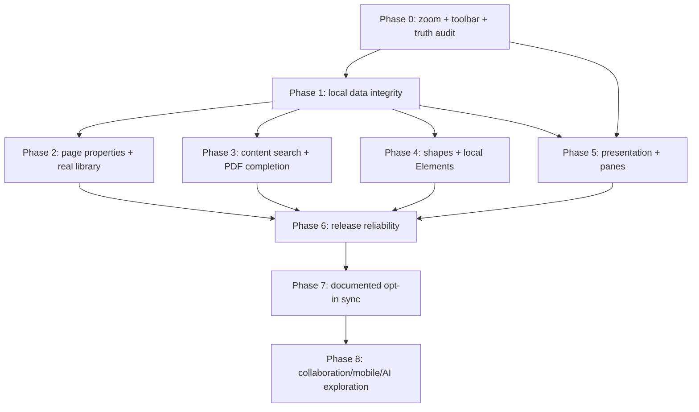

# Panvas Implementation Roadmap

> [!NOTE]
> **Historical Document**: This document reflects early planning/development phases (August-September 2026). For the canonical v0.1.0 architecture and documentation, see [README.md](../README.md) and [docs/ARCHITECTURE.md](ARCHITECTURE.md).

Status: proposed implementation plan, 2026-08-22. This document is a planning and research deliverable; it does not claim that every referenced feature is implemented.

## 1. Product vision and product boundary

Panvas is a **local-first, desktop-first visual workspace**: structured notebooks and pages, handwriting and rich text, PDFs and annotations, and an infinite canvas for visual thinking. It should learn from Goodnotes, FreeNotes, OneNote, and Excalidraw without becoming a clone of any of them.

The product boundary is deliberate:

- Keep the local workspace usable with no account and no network.
- Make handwriting, documents, PDFs, visual thinking, and structured project work feel like one system.
- Treat cloud sync as an opt-in transport layer, not the source of truth.
- Preserve the current Electron security boundary: renderer UI → restricted preload → validated main-process IPC. The Obsidian knowledge reader remains separate and read-only.
- Do not build marketplace, social sharing, AI/OCR, collaboration, mobile, or a provider-specific sync client before core local data and recovery are proven.

## 2. Evidence, terminology, and research limits

### 2.1 Status labels

| Label | Meaning |
| --- | --- |
| **Implemented** | Source-code evidence and the current application show a real capability. It still needs regression coverage. |
| **Partial** | A useful vertical slice exists, but important workflows, persistence, edge cases, or validation are incomplete. |
| **Broken / P0** | A current defect blocks an expected core workflow. |
| **Planned** | Selected for Panvas but not started. |
| **Future** | Valuable only after the local core, reliability, and release gates are complete. |

### 2.2 Sources and confidence

**Confirmed product research** comes from official documentation:

- [Goodnotes for Android, Windows, and Web](https://support.goodnotes.com/hc/en-us/articles/7378598719759-Getting-Started-with-Goodnotes-for-Android-Windows-and-Web): library, templates, and primary writing tools.
- [Goodnotes import workflow](https://support.goodnotes.com/hc/en-us/articles/7353717816463-Import-files-into-Goodnotes): local and connected-storage import patterns.
- [Goodnotes Elements](https://support.goodnotes.com/hc/en-us/articles/7353727577359-Elements-Tool-Enrich-your-Notes): reusable collections, offline behaviour, and GIF constraints.
- [Goodnotes shapes and diagramming](https://support.goodnotes.com/hc/en-us/articles/13682939148943-Improved-Shape-Tool): editable shapes, connectors, styling, and recognition patterns.
- [Goodnotes presentation mode](https://support.goodnotes.com/hc/en-us/articles/7353727934223-Presentation-Mode): temporary dot/trail laser semantics.
- [OneNote organization](https://support.microsoft.com/en-us/onenote/organize-your-notes) and [templates](https://support.microsoft.com/en-us/onenote/create-or-customize-page-templates): durable notebook/section/page organization and page-default/template behavior.

**FreeNotes observations** are limited: the supplied screenshots demonstrate split panes, compact contextual toolbars, sticker/GIF selection, shapes, color controls, and a laser control. I did not find sufficiently authoritative current FreeNotes desktop/web documentation to claim platform support or internal behavior. Those observations therefore inform **Panvas recommendations**, not feature parity commitments.

## 3. Current Panvas state: repository audit

### Implemented baseline

- Electron desktop shell with a restricted, validated IPC bridge and filesystem-backed workspace metadata; IndexedDB remains used for local browser data and binary assets.
- Workspace → folder → nested folder → notebook → section → page hierarchy, item ordering, rename/move/delete flows, and trash-oriented records.
- Notebook page workflow: persistent vector ink, pen/pencil/highlighter/marker, erasers, selection, moving/resizing selected objects, undo/redo, rich text, image insertion, basic shapes, page sorting, duplication, and reordering.
- Page/PDF view infrastructure: `ResizeObserver`, page navigation, zoom controls/shortcuts, thumbnails, local PDF worker handling, and notebook-engine annotation integration are present in source.
- Canvas baseline (Phase 10 Complete): Excalidraw scenes, custom visual blocks (Voice notes, LaTeX, Markdown, PDF), canvas repositories, Draw-to-Shape with gesture replacement, full 4-tier hierarchy interoperability (Workspace, Folder, Notebook, Section ownership), drag-and-drop moves, and image/PDF drop routing.
- Current toolbar already groups primary tools first and has a `ResizeObserver` plus a More Tools overflow mechanism. The roadmap below improves it; it does not replace it wholesale.
- Security/hardening and read-only knowledge consumer phases are complete. The renderer never receives the vault credential or arbitrary filesystem primitives.

### Partial or needing verification

**Owner closure (2026-08-25): Phase 0 is complete.** The forensic report later in this document is retained as implementation history. New work must not reopen P0 unless a demonstrable regression is introduced.

- Two-page/horizontal zoom has a current user-observed defect and is P0. *(Reconciled 2026-08-22: current source has a vertical-only notebook layout — `NotebookRenderer.tsx` computes a purely vertical `layoutConfig`; the horizontal/2-page modes described in older docs are not in the code. The ticket's surviving requirement — zoom must not jump, crop, or desynchronize — applies to the vertical zoom path, which uses anchor-based scroll correction and passed the automated focal-point stability check in `tests/toolbar-resize.test.ts`. Ticket closed as moot for the absent modes; re-open if a two-page mode is ever introduced.)*
- The responsive notebook toolbar exists but does not yet satisfy small/half-window usability requirements in all states. *(Reconciled 2026-08-22: implemented and verified — bracket contract in `src/components/notebook/toolbarLayout.ts`, unit tests, and an automated live-resize suite against the production build; see "Phase 0 execution status" at the end of this document.)*
- Page properties, notebook defaults, template inheritance, per-page overrides, and reversible transactional apply-to-all are implemented as of Phase 2 (2026-08-25). Legacy drawing properties remain readable until a page adopts metadata inheritance.
- Shapes are a useful baseline; connector routing, text-in-shape, fill/stroke system, snapping, bindings, and robust object editing are incomplete.
- PDF rendering/annotation has significant code, but import → annotate → reopen → export and large-PDF validation need a clear acceptance suite. Older documentation calling all PDF functionality mock is stale and must be reconciled by Phase 0. *(Reconciled 2026-08-22: source audit confirms real pdf.js rendering, thumbnails, annotation integration, and a local worker in `PdfWorkspace.tsx` / `PdfPageRenderer.tsx`. The "mock" claims in `docs/codebase/18_KNOWN_ISSUES.md` and the `docs/` root generation describe the earlier pre-Electron preview app and are preserved as history, not current status. The end-to-end acceptance suite remains open Phase 3 work.)*
- The Library is repository/store-backed as of Phase 2 (2026-08-25), with real folders, notebooks, canvases, PDFs, recent/favorite/trash views, search/filtering, and canonical record opening. Static Workspace Explorer product routes were removed; unrelated design previews remain explicitly non-product routes.
- Global search is largely title/metadata oriented; content indexing is not yet a documented, measured feature.
- Sync code and RLS migrations exist, but it covers only a subset of entities and does not yet establish a safe, versioned cross-device contract for notebook pages, drawings, PDFs, images, conflicts, or recovery.

### Explicitly not a current commitment

Handwriting OCR, collaborative CRDT editing, a marketplace, remote GIF search, a mobile app, and Photoshop-class raster brushes are not prerequisites for the first Panvas public release.

## 4. Research synthesis: workflows worth adopting

| Pattern | Confirmed/inferred source | Recommendation for Panvas |
| --- | --- | --- |
| Library separates documents, favorites, shared items, and trash | Goodnotes confirmed | Implement **Local Library**, Favorites, and Trash. Defer Shared until sync is safe. Do not add a marketplace to MVP. |
| Creation is a compact typed menu rather than one giant document type | Goodnotes confirmed | Keep one New action; offer Notebook, Canvas/Whiteboard, Folder, Quick Note, and Import only when they create real entities. Defer text-document as a separate type until its model is justified. |
| Template selection sets defaults during notebook creation | Goodnotes/OneNote confirmed | Persist notebook defaults and let pages override them. Avoid copying covers/marketplace concepts first. |
| Contextual tool settings contain color and thickness | Goodnotes confirmed | Keep Panvas's floating toolbar; make settings shared, persistable, keyboard-accessible, and responsive. |
| Lasso can select specific object classes | Goodnotes confirmed | Add selection filters only after the current selection model is reliable for ink/text/images/shapes. |
| Reusable elements are local collections, not merely sticker images | Goodnotes confirmed | Design a future local Element collection that can hold selected Panvas object groups. This is more valuable than a sticker store. |
| GIF discovery requires network but inserted GIFs remain available offline | Goodnotes confirmed | Defer remote GIF search. Later, cache inserted assets locally and treat their license/source metadata explicitly. |
| Shapes benefit from editable connectors and object semantics | Goodnotes confirmed; Excalidraw-compatible direction | Extend the existing notebook shape model incrementally; do not replace the canvas engine. |
| Laser pointer is temporary, not a saved drawing | Goodnotes confirmed; reference screenshots show dot/line UI | Add only with presentation mode; never serialize laser marks into a page. |
| Split view supports reference + note workflows | FreeNotes screenshots/inference | Build this as a pane-layout capability, not a duplicated editor component. |
| Read mode separates reading from editing without changing permission | Goodnotes/OneNote-style reading workflow | Add a user-controlled distraction-free mode after page navigation and viewport contracts are stable. |
| Stylus-first writing needs tool-specific input behavior | Goodnotes/OneNote-style workflow | Treat latency, pressure, palm/UI interaction, and gesture false positives as quality gates rather than visual polish. |

## 5. Feature gap matrix

| Feature | Panvas status | Reference pattern | Priority | Recommendation |
| --- | --- | --- | --- | --- |
| **Phase 0 forensic gate** | **Complete (owner accepted 2026-08-25)** | Native-scale Electron | done | Preserve the responsive/native-scale contract; reopen only for a demonstrable regression. |
| Horizontal/two-page zoom | **Closed as moot / vertical zoom verified** *(2026-08-22: two-page and horizontal modes no longer exist in source; the vertical zoom path passed the automated focal-point stability check — 49px drift on a ~1000px viewport across a Ctrl+= step, no jump/crop)* | Two-page reading workflow | ~~P0~~ closed | Re-open only if a two-page mode is reintroduced; then fix viewport math and regression-test before new features. |
| Responsive toolbar | **Implemented / P0 closed** *(2026-08-22: `toolbarLayout.ts` bracket contract, 12 unit tests, automated live-resize suite over 18 width configurations with sidebar/panel state matrix)* | Compact/overflow toolbars | done | Preserve primary tools, move groups—not random buttons—to overflow. Upheld: primary tools inline or in More at every tested width; overflow is always a group-suffix in the contract order. |
| Pen, pencil, marker/highlighter | Implemented | Tool-specific settings | P1 hardening | Consolidate tool settings/palettes and verify stylus/mouse behavior. |
| Eraser and selection/lasso | Implemented baseline | Object-aware selection | P1 hardening | Add selection filters after stability tests. |
| Text and images | Implemented baseline | Page object editing | P1 hardening | Finish persistence/recovery and object manipulation tests. |
| Shapes/lines/arrows | Partial | Shape libraries/connectors | P1 | Complete object editing/styling before recognition or advanced routing. |
| Page management | Implemented baseline | Thumbnails, reorder, duplicate | P1 | Add regression coverage and accessibility. |
| Page properties/templates | Partial | Defaults plus per-page override | P1 | Define model and apply-all transaction semantics. |
| Folder hierarchy/favorites/trash | Implemented baseline / partial surfaces | Library organization | P1 | Finish real Library view; defer Shared. |
| Full-text search | Partial | Search across documents | P1 | Index persisted content, not preview/mock data. |
| PDF workflow | Partial | Import, annotate, export | P1 | Establish end-to-end persistence/export test matrix. |
| Home / dashboard | Partial / preview-oriented surfaces | Documents home and compact New menu | P1 | Make a repository-backed local Home/Library; do not add task/schedule systems to MVP. |
| Folder customization | Partial | Named/color-coded folders | P2 | Add color/icon metadata after the real Library is repository-backed; custom artwork remains later. |
| Read mode | Missing | Distraction-free document reading | P2 | Separate a user mode from authorization/read-only permissions. |
| Printing | Missing | Paper-aware notebook output | P2 | Print page ranges/notebooks only after page-property and export fidelity are defined. |
| Toolbar customization | Partial | Saved writing presets and adjustable tool access | P2 | Preserve P0 responsive behavior first; then add saved presets and user ordering safely. |
| Scribble/strike-to-erase | Missing | Stylus gesture workflow | P2 | Add only after input, hit testing, and undo semantics are stable. |
| Layers | Missing | User-facing document/canvas layers | P1 | Add a serializable layer model before advanced Elements/media; never confuse this with CSS stacking. |
| Reusable elements/stickers | Missing | Local reusable collections | P2 | Build generic local Elements only after selection/serialization is stable. |
| Audio / voice notes | Missing | Note-attached recording | P2 | Add local attachment recording/playback before any transcription. |
| Embedded video / picture-in-picture | Missing | Moveable page media | P3 | Defer until local media storage, lifecycle, and export policy are proven. |
| GIF search | Missing | Online discovery + offline cached insert | P3 | Defer until asset policy and licensing are defined. |
| Laser/presentation | Missing | Dot and temporary trail | P2 | Add after viewport and input contracts are stable. |
| Split screen/two documents | Missing | Independent panes | P2 | Build after each document session can be isolated. |
| Browser release | Partial architecture | Browser-local capability | P1 release | Explicitly support IndexedDB mode; no Electron-only promises. |
| Windows release | Partial packaging | Signed desktop installer | P1 release | Complete signing and clean-machine checks. |
| OneDrive/Google/Dropbox/Box | Not ready | Provider import/sync | Future | First define generic sync/export contract; OneDrive is the first provider, not a filesystem shortcut. |
| Sharing/collaboration | Missing | Shared libraries | Future | Do not start before conflict-safe sync. |
| OCR/AI | Missing | Handwriting intelligence | Future | Re-evaluate only after performance/privacy/local data are reliable. |

## 6. Architecture recommendations

### 6.1 Preserve the existing architecture

Use incremental seams already present in the codebase:

`React UI → Zustand action → repository → Electron IPC or browser IndexedDB → local data`

- Keep renderer code free of Node filesystem, provider tokens, and raw operating-system paths.
- Route persistent changes through repositories and the existing atomic write queue.
- Keep browser persistence behind the same repository/domain interfaces where practical; browser mode must fail gracefully when desktop-only operations are unavailable.
- Keep notebook/canvas page objects serializable and versioned. Every new object type needs an explicit schema, renderer, hit test/selection behavior, undo entry, persistence adapter, migration story, and export policy.
- Treat `window.panvas.knowledge` as a separate five-operation read-only API. New note-taking features must not widen it.

### 6.2 Recommended organization model

```text
Workspace
├── Folder*                         (recursive; name, color/icon optional later)
│   ├── Notebook                    (default page properties + cover optional)
│   │   └── Section
│   │       └── Page                (ordered, per-page property overrides)
│   ├── Canvas / Whiteboard
│   └── Imported document / PDF
├── Favorites                       (references, not duplicated files)
└── Trash                           (soft-deleted records with restore metadata)
```

Do not make a folder's color/icon a P0 data-model change. Add optional presentation metadata only when the real Library UI needs it.

### 6.3 Page-properties model

```ts
type PaperStyle = 'blank' | 'ruled' | 'grid' | 'dot' | 'custom-template';

interface PageProperties {
  paperStyle: PaperStyle;
  paperColor: string;
  lineColor?: string;
  size: 'A4' | 'A5' | 'letter' | 'custom';
  orientation: 'portrait' | 'landscape';
  margins: 'none' | 'narrow' | 'normal' | 'wide' | 'custom';
  templateId?: string;
}

interface NotebookProperties {
  defaultPageProperties: PageProperties;
  defaultTemplateId?: string;
}
```

Rules:

1. A page stores only overrides from the notebook default where possible.
2. “Apply to all pages” is a named, reversible batch command with a confirmation and one undo/history entry—not an uncontrolled loop of UI writes.
3. Zoom is a per-view/session preference, not document content. Persist it separately by page or pane only if user research supports it.
4. A template is versioned asset/layout metadata; it must never silently overwrite a page’s user-created content.

### 6.4 Tool and object model

- **Primary writing tools:** Pen, Pencil, Highlighter/Marker (one visible control with selectable variants), Eraser, Text, Select/Lasso.
- **Primary utility controls:** Undo/Redo and Hand/Pan.
- **Secondary tools:** Shapes, Image, Elements, Laser, table/embed and future advanced actions.
- **Object capabilities:** `select`, `move`, `resize`, `rotate`, `duplicate`, `delete`, `z-order`, plus tool-specific appearance edits.
- **Colors:** presets per tool, a custom picker, recent colors, and persisted user palette. Never share opacity/thickness defaults between a pen and a highlighter unless the user deliberately chooses to.
- **Toolbar customization (later than P0):** users may save multiple pen and highlighter/marker presets, choose which frequently used tools appear directly, and reorder eligible tools. The system must retain the P0 primary-tool and responsive-overflow guarantees; customization cannot make essential tools unreachable.
- **Stylus-first quality:** use Pointer Events consistently, preserve pressure where supported, keep drawing distinct from UI gestures, and measure input-to-stroke latency. Palm rejection is primarily an operating-system/device capability; Panvas must avoid treating incidental touch/pointer input as a destructive command.
- **Layers (user-facing document feature):** the eventual model must group page/canvas objects into ordered named layers with visibility and locking. Layer state is document data, not CSS z-index or browser layering.

## 7. Responsive toolbar strategy

The current width-aware grouping is the right starting point. The finished behavior must be deterministic and keyboard accessible.

Primary targets are desktop, laptop/smaller desktop windows, and iPad/tablet-sized layouts. Mobile browser support is secondary and must not drive desktop compromises. Tablet layouts require touch/stylus targets and no hover-only critical action; desktop layouts retain mouse, trackpad, and keyboard efficiency.

| Viewport available to toolbar | Required behavior |
| --- | --- |
| **Large desktop ≥ 1200 px** | History, all primary tools, hand/select, image, compact shapes, format control, and More. Tool settings open contextually. |
| **Normal desktop 960–1199 px** | Keep history and primary tools. Move image and shape group into More if necessary. Never wrap into a second uncontrolled row. |
| **Half-window 720–959 px** | Keep Undo/Redo, Pen, Pencil, Highlighter/Marker, Eraser, Text, Select. Hand, Image, Shapes, and formatting live in More. Tool labels remain available by tooltip/keyboard. |
| **Small desktop 560–719 px** | Keep a compact history control, Pen, Highlighter/Marker, Eraser, Text, Select, and More. Pencil is reachable from the Pen control or More without losing its dedicated settings. |
| **Narrow < 560 px** | Use a deliberate compact toolbar with one active-tool control, Select, Undo, Redo, and More; do not horizontally overflow page content. This is a minimum-viable browser layout, not a substitute for mobile design. |
| **Tablet/iPad-sized layout** | Keep writing tools reachable by touch/stylus, use larger hit targets and contextual settings, avoid hover-only paths, and preserve independent page zoom/pan. This is a responsive interaction target, not a promise of a native iPad build. |

Implementation rules:

- Overflow complete **tool groups** in a stable order: formatting → shapes → image → hand → less-used writing variant. Do not move an active tool without keeping its visible active state.
- Give each command one source of truth and a stable keyboard shortcut. Avoid duplicated “preview toolbar” command definitions.
- Use an accessible menu with focus return; close it on tool activation.
- Test resizing live while drawing, with selected text, and with an open settings popover.
- Test pen, touch, mouse, and trackpad paths separately. A stylus gesture must never erase content when the user intended a normal stroke.

## 8. Prioritized implementation roadmap

### Phase 0 — P0 regression triage and truth audit

**Priority:** P0  
**Difficulty:** Medium  
**Dependencies:** none

1. Reproduce and fix the horizontal/two-page zoom issue with a minimal viewport regression harness.
2. Complete responsive toolbar behavior for half-window and narrow desktop widths using the strategy above.
3. Audit and reconcile stale documentation against real source behavior, especially notebook and PDF status. Preserve historical docs; add a current status matrix rather than rewriting history.
4. Add targeted tests for zoom, toolbar overflow, active-tool retention, page navigation, and drawing save recovery.

**Acceptance criteria:** two-page and one-page zoom do not jump, crop, or desynchronize; the toolbar never obscures essential controls or overflows; P0 behavior has automated coverage.

### Phase 1 — Local data integrity and core note workflow

**Priority:** P1  
**Difficulty:** High  
**Dependencies:** Phase 0

1. Define and test durable persistence for rich text, ink, image, page properties, and page ordering.
2. Complete migration, delete/restore, recovery, and backup/export semantics for all real entities.
3. Harden selection, image manipulation, erasing, undo/redo, stylus/mouse behavior, and object serialization.
4. Establish a browser-mode capability matrix: IndexedDB works locally; desktop-only file actions are clear and safe.
5. Define stylus/pointer quality gates: pressure fallback, low-latency stroke rendering, correct pen/touch/mouse routing, and destructive-gesture protection.
6. Specify and prototype-test scribble/strike-to-erase as a **P2 stylus enhancement**: recognize deliberate horizontal, vertical, and multi-stroke scribbles; hit-test only eligible ink; surface a reversible deletion through history; and reject ambiguous marks to avoid false positives.

**Acceptance criteria:** create → edit → restart → reopen → restore works for a mixed note; intentional failure does not falsely report save success; browser mode has no Electron dependency leak; stylus and mouse paths preserve smooth writing without accidental gesture deletion.

**Phase 1 checkpoint (2026-08-25)**

- **STATUS:** Complete; the owner accepted the successful Electron integrity gate as sufficient.
- **IMPLEMENTED:** browser-local page content/drawing persistence; Dexie v4-to-v5 migration; Electron last-good workspace recovery; mixed ink/text/image restart and trash/restore coverage; explicit notebook save-state errors; local Excalidraw assets for offline startup; browser capability contract.
- **VALIDATION:** `npm test` (22 pass), `npm run test:resize` (pass), `npm run test:browser-integrity` (2 pass), `npm run test:electron` (pass), prior successful `npm run test:integrity`, and `npm run build` (pass). Do not repeat these Electron gates unless relevant persistence/native code changes.
- **KNOWN LIMITATIONS:** portable user-facing export/import format remains Phase 3 work; browser storage is origin-scoped IndexedDB and must not be represented as a filesystem workspace.
- **NEXT PHASE:** Phase 2 — page properties, templates, and repository-backed Library organization.

### Phase 2 — Page properties, templates, and real Library organization

**Priority:** P1  
**Difficulty:** Medium–High  
**Dependencies:** Phase 1

1. Implement the page/notebook property contract in Section 6.3 and migrate existing records safely.
2. Add template registry, notebook defaults, per-page overrides, and reversible apply-to-all.
3. Replace static Explorer/Library samples with repository-backed documents, folders, favorites, recent items, and trash.
4. Add Quick Note only if it creates a standard page/notebook through the same model.
5. Establish a proper local Home/Dashboard: recent documents, workspaces, folders, favorites, trash, search entry point, New actions (Notebook, Canvas/Diagram, Quick Note, Folder, Import), and clean navigation to/from editors. Tasks and scheduled items remain optional future extensions rather than MVP data types.
6. Add optional folder color and icon metadata with local persistence and future-sync compatibility. Defer custom folder artwork/images until an asset policy supports it.
7. Verify theme initialization and switching across Library/Home, dialogs, menus, toolbars, page/canvas surfaces, and paper/ink-oriented modes. Preserve the existing light/dark/ink design system; do not create arbitrary themes.

**Acceptance criteria:** changing page properties survives restart; apply-all is atomic/reversible; Home/Library uses real records rather than samples; folder appearance and selected theme survive restart without visual drift.

**Phase 2 checkpoint (2026-08-25)**

- **STATUS:** Complete.
- **IMPLEMENTED:** portable notebook defaults; per-page override inheritance; zoom removed from document properties; atomic apply-to-all in one filesystem metadata write or IndexedDB transaction; one-step batch undo; existing template registry retained; new-page defaults; repository-backed `/app/library` with real folders, notebooks, canvases, PDFs, recents, favorites, trash, filters, and record opening.
- **KEY FILES:** `src/types/notebook.ts`, `src/lib/pageProperties.ts`, `NotebookRenderer.tsx`, `NotebookToolPropertiesPanel.tsx`, `LibraryWorkspace.tsx`, repository/database/IPC adapters.
- **VALIDATION:** `npm run typecheck` passed; `npm test` passed (25); production build passed. No repeat Electron launch was required because Phase 1 already proved the unchanged persistence/restart boundary.
- **KNOWN LIMITATIONS:** notebook favorites are represented in metadata but do not yet have a Library card pin control; portable export and content/PDF indexing remain Phase 3.
- **NEXT PHASE:** Phase 3 — deterministic content search and PDF workflow completion.

### Phase 3 — Search and document/PDF completion

**Priority:** P1  
**Difficulty:** High  
**Dependencies:** Phase 1; Phase 2 for complete metadata

1. Build deterministic local indexing for titles, rich-text content, tags, and supported PDF text. Indexing must be rebuildable from canonical local records.
2. Verify/fix PDF import, page rendering, thumbnails, annotations, navigation, persistence, and export in a real test matrix.
3. Define supported import/export formats and error messages; do not promise unsupported file conversion.
4. Add large-document, large-PDF, corrupt-import, and recovery tests.
5. Define print output as a first-class export target: current page, selected pages, full notebook/document, page range, paper size, orientation, margins, and supported page/background/template fidelity. Printing is **P2** and begins only after page-property and export correctness are proven.

**Acceptance criteria:** search returns and opens content-level results; imported PDFs survive restart with annotations; export and print have documented fidelity limits and do not silently discard unsupported objects.

**Phase 3 checkpoint (2026-08-25)**

- **STATUS:** Complete. Printing remains the explicitly deferred P2 capability described above, not a Phase 3 blocker.
- **IMPLEMENTED:** rebuildable in-memory local indexing for titles, persisted rich text/drawing content, canvas blocks, metadata tags, and extractable PDF text; deterministic all-term ranking and canonical result opening; direct PDF-page search navigation; pre-import size/corruption/encryption validation; canonical per-PDF-page annotation ownership and persistence; full-document annotated PDF export with explicit unsupported-object warnings.
- **KEY FILES:** `src/services/search/LocalSearchIndex.ts`, `src/services/search/rankLocalSearchDocuments.ts`, `CommandPalette.tsx`, `validatePdfImport.ts`, `renderPdfAnnotations.ts`, `exportAnnotatedPdf.ts`, `PdfWorkspace.tsx`, and notebook repository/database/IPC ownership adapters.
- **VALIDATION:** typecheck passed; unit/interaction suite passed (28), including ranking, corrupt-PDF rejection, coordinate mapping, and rendered PDF annotation output; production build passed; the real Electron PDF gate passed with import/render, filesystem storage, a drawn annotation, restart after IndexedDB PDF-byte loss, and annotation survival.
- **FIDELITY CONTRACT:** `docs/IMPORT_EXPORT_SUPPORT.md` documents supported formats, the 200 MB import limit, explicit omissions, browser/Electron storage behavior, and recovery boundaries.
- **KNOWN LIMITATIONS:** search rebuild is intentionally on demand rather than continuously incremental; PDF rich-text/font fidelity, non-basic object export, range export, and printing remain future work.
- **NEXT PHASE:** Phase 4 — user-facing layers, shape completion, and connected local Elements.

### Phase 4 — Notebook canvas expansion: shapes and reusable local elements

**Priority:** P1 for shapes; P2 for Elements  
**Difficulty:** High  
**Dependencies:** Phase 1 selection/serialization; Phase 2 asset model

1. Add a user-facing, serializable layers system for notes/canvases: create/delete/rename/reorder layers; show/hide and lock/unlock; layer-aware drawing, editing, selection, and erasing; persistence through save/load/export; and explicit handling for PDF/image backgrounds, ink, shapes, text, and Elements. This is **P1** because all later object expansion depends on it.
2. Finish shapes: rectangle, rounded rectangle, ellipse, triangle, diamond, line, arrow, stroke/fill/opacity, resize, rotation, snapping, and undo/redo.
3. Add connectors and text-in-shape only after basic shape geometry is robust.
4. Expand local **Elements** collections: user-created reusable selections, bundled starter emoji/sticker/colored-sticky-note assets, categories, browsing, recents, favorites, import/export, and consistent insert/move/resize/rotate/duplicate/delete/reuse behavior. An Element is compatible with the current generic-object direction, not a one-off sticker subsystem.
5. Add local audio/voice notes as **P2 attachments** associated with a page/note: explicit recording state/controls, playback, attachment persistence, recovery, and deletion. Audio transcription/summarization is not part of this initial feature.
6. Defer embedded video and picture-in-picture-style floating media to **P3**: a moveable/resizable page media object with local-storage limits, playback controls, lifecycle/recovery, and export rules must be specified first.
7. Add **P2 toolbar customization** only after Phase 0's fixed responsive contract is proven: saved pen/highlighter/marker presets, per-tool color/thickness settings, user-selected directly visible tools, and safe reordering of eligible secondary/frequent tools. Overflow remains available and primary-tool guarantees remain non-negotiable.
8. Defer remote GIF search. If later approved, new GIFs require network; inserted assets are locally cached and safely serialized.

**Acceptance criteria:** every object and layer can be selected, edited, persisted, restored, and exported; local Elements work offline; audio recovery is tested; no external service is required for starter stickers/elements.

**Phase 4 checkpoint (2026-08-25)**

- **STATUS:** Core phase complete. Connector bindings, text-in-shape, user-defined toolbar ordering, and embedded video remain explicitly deferred enhancements; none is represented as implemented.
- **IMPLEMENTED:** versioned page layers with active/visible/locked/order state; layer-aware rendering, hit testing, selection, erasing, editing, persistence, and PDF export; expanded shape geometry/style controls; offline workspace-local reusable Elements with starter assets, categories, favorites, and JSON import/export; workspace-local drawing presets; page/PDF audio attachments with local recording/import/playback/deletion and durable binary storage.
- **KEY FILES:** `LayerManager.ts`, `AudioNoteManager.ts`, `shapeGeometry.ts`, `NotebookLayersControl.tsx`, `NotebookElementsControl.tsx`, `NotebookAudioControl.tsx`, `LocalElementRepository.ts`, `NotebookEngine.ts`, `SelectionEngine.ts`, `CanvasRepository.ts`, and the validated Electron binary/settings handlers.
- **VALIDATION:** typecheck passed; unit/interaction suite passed (34); all 18 responsive toolbar configurations passed; production build passed; browser integrity gate passed with a mixed page, a second layer, a saved Element, and an audio attachment surviving reload. The gate exposed and fixed a stale debounced-save race that could overwrite a newer immediate attachment/layer save.
- **KNOWN LIMITATIONS:** advanced connector binding and text-in-shape require a separate geometry contract; layer commands are durable but not yet individual history entries; toolbar values/presets persist but direct tool reordering is not yet exposed; live microphone permission/device behavior remains a native manual check; PDF export warns when audio or unsupported objects are omitted.
- **NEXT PHASE:** Phase 5 — reversible Read/Presentation modes and a persisted, non-destructive pane-layout model.

### Phase 5 — Presentation and multi-pane workspace

**Priority:** P2  
**Difficulty:** High  
**Dependencies:** Phase 0 viewport stability; Phase 1 isolated document sessions

1. Add Presentation Mode and a non-persistent Laser tool: red dot and one-second fading trail, excluded from undo/history/save/export.
2. Introduce a pane layout model: `single | vertical-split | horizontal-split | two-page` with pane IDs, active document refs, independent viewport state, and split ratios.
3. Start with PDF + note and two pages of one notebook; later allow two arbitrary documents.
4. Add optional synchronized page/scroll only for compatible document types and only when deliberately enabled.
5. Add a user-facing **Read Mode** as a P2 view mode: hide/minimize editing tools, retain page navigation and reading zoom, and transition cleanly back to Edit Mode. It is not an access-control or permission feature.

**Acceptance criteria:** panes resize without remounting/destroying another pane’s editor; zoom/scroll remain independent; Read Mode is reversible and retains navigation; restore of a saved layout never mutates document content.

**Phase 5 checkpoint (2026-08-25)**

- **STATUS:** Core phase complete. Arbitrary dual-document editing and optional synchronized scrolling remain later enhancements.
- **IMPLEMENTED:** persisted UI-only `single | vertical-split | horizontal-split | two-page` layout state; resizable side-by-side/top-bottom primary-editor plus read-only reference panes with independent scroll/zoom; real paired-column notebook spreads; reversible Read Mode; distraction-free Presentation Mode with non-persistent dot/one-second trail laser; safe restart behavior that always returns to Edit Mode; compact Page Utilities overflow for narrow editor panes.
- **KEY FILES:** `layoutStore.ts`, `WorkspaceContent.tsx`, `WorkspaceViewControls.tsx`, `ReferencePagePane.tsx`, `PresentationOverlay.tsx`, `NotebookPageUtilities.tsx`, `NotebookRenderer.tsx`, and `PdfWorkspace.tsx`.
- **VALIDATION:** typecheck and production build passed; unit/interaction suite passed (34); browser integrity passed with split selection/resizing, paired two-page geometry, Read/Presentation transitions, laser visibility, Escape recovery, and proof that drawing objects/audio metadata were unchanged; all 18 toolbar/window-width configurations passed. That responsive gate first exposed a 1000px/sidebar-open overlap, which was fixed by compacting secondary page utilities without hiding access.
- **KNOWN LIMITATIONS:** the secondary pane is intentionally a read-only reference for this first isolated-session slice; PDF references currently preview the first page without the live annotation overlay; synchronized navigation and two arbitrary editable documents are not implemented; native projector/stylus behavior remains a manual platform check.
- **NEXT PHASE:** Phase 6 — release reliability, accessibility, performance budgets, hardening, and platform checklists.

### Phase 6 — Reliability, accessibility, and release candidates

**Priority:** P1  
**Difficulty:** High  
**Dependencies:** Phases 1–5 as applicable

1. Performance budgets for startup, 100+ page notebooks, large canvases, PDF thumbnails, and memory use.
2. Keyboard navigation, focus management, screen-reader labels, contrast, scaling, and pen/mouse fallback audit.
3. Crash/error boundaries, recovery prompts, diagnostics without secrets, and regression/E2E suite.
4. Windows signing, icon/publisher setup, clean-machine install/uninstall/upgrade testing, checksum, and release notes.
5. Browser release validation: supported browsers, IndexedDB quotas, offline/online messaging, CSP, and no privileged APIs.

**Acceptance criteria:** release checklist passes on clean machines; no critical accessibility or data-loss regression is open; Windows and browser feature matrices are published.

**Phase 6 checkpoint (2026-08-25)**

- **STATUS:** Automated engineering candidate complete; the public-release acceptance gate remains open pending owner/platform certification.
- **IMPLEMENTED:** cloud sync and analytics are disabled by default behind explicit build flags; Electron permission checks allow only trusted main-frame audio capture; CSP denies inline script/object/frame execution; production errors use incident IDs without stack disclosure; sign-out preserves local records; browser mode has a same-origin offline shell and explicit local/offline status; release artifact/bundle/secret checks, accessibility-name smoke coverage, platform capability documentation, and OneDrive-safe Windows packaging are present. The packaged executable uses the existing Panvas icon.
- **KEY FILES:** `features.ts`, `security-policy.ts`, `main.ts`, `App.tsx`, `authStore.ts`, `ErrorBoundary.tsx`, `service-worker.js`, `check-release.mjs`, `package-windows.mjs`, `release-readiness.test.ts`, `browser-integrity.test.ts`, `electron-pipeline.test.ts`, and `RELEASE_READINESS.md`.
- **VALIDATION:** typecheck/build passed; 37 unit/security/data tests passed; release check passed (1.42 MB gzip application entry, 1.25 MB Excalidraw support, 2.67 MB total, 53 KB Electron main, zero source maps/sensitive config); browser persistence/schema-upgrade/offline suite passed (3); responsive suite passed all 18 width states; native Electron PDF/security gate passed; native mixed-note/recovery/trash/failure gate passed; production dependency audit reported zero vulnerabilities; unpacked Windows x64 package completed and its ASAR contained none of the forbidden config/secret/source-map paths.
- **KNOWN LIMITATIONS / PUBLICATION BLOCKERS:** legal license/copyright and publisher identity are undecided; no owner Authenticode certificate was supplied; signed NSIS clean-profile install/upgrade/uninstall, checksum/release-note publication, native keyboard/screen-reader/200% scaling, stylus latency, 100-page memory, and large-PDF performance remain human/platform gates. These entries are not certified PASS.
- **NEXT PHASE:** close the owner/platform Phase 6 gate, then begin Phase 7 with the provider-neutral Sync-0 specification and final-entity/RLS audit. Do not enable Supabase or implement OneDrive OAuth before that gate and explicit owner authorization.

### Phase 7 — Cloud sync design, documentation, and opt-in implementation (FINAL V1 FEATURE)

> **HISTORICAL — superseded by [`CLOUD_SYNC_V0_1_ARCHITECTURE.md`](CLOUD_SYNC_V0_1_ARCHITECTURE.md).**
>
> The planning notes below describe the pre-V2/legacy Supabase audit. Current
> Cloud Sync is the feature-frozen Google Drive V2 implementation documented
> above; retain these notes only for historical context.

**Priority:** Final V1 Gate  
**Difficulty:** Very High  
**Dependencies:** stable local schemas, export/backup, conflict test suite, security review

1. Write a provider-neutral sync specification before adding a provider: identity, manifest/versioning, change journal, tombstones, binary assets, retries, conflicts, encryption/privacy, telemetry, recovery, and support boundaries.
2. Audit existing Supabase queue/RLS code against the final entity set; do not expose it as production sync until notebook pages, drawings, PDFs, images, folders, and deletions are covered.
3. Build OneDrive as the first optional provider only after the generic local manifest/export contract exists. Google Drive, Dropbox, and Box follow through the same adapter interface—not four bespoke implementations.
4. Add offline-first two-device tests: concurrent edit, delete vs edit, asset upload interruption, provider outage, account switch, and restore from backup.

**Acceptance criteria:** users can disable sync without losing local access; every conflict has a visible deterministic outcome; tokens stay in secure main-process/OS storage and never reach the renderer.

**Sync-0 preparation checkpoint (2026-08-25)**

- **STATUS:** Provider-neutral specification and final-entity/RLS audit complete; Phase 7 implementation has not started and cloud sync remains disabled.
- **DELIVERABLE:** `SYNC_0_SPEC.md` defines the canonical local sources, versioned manifest, immutable hash-addressed objects, main-process provider boundary, ETag/`ifMatch` publication, durable tombstones, visible conflict sidecars, recovery flow, diagnostics limits, and ten-scenario acceptance suite.
- **AUDIT RESULT:** the legacy Supabase engine covers 4 of 15 required local record families and its renderer Dexie outbox is bypassed by native Electron writes. Existing remote schema/RLS covers only workspaces, folders, canvas files, and canvas metadata. Notebook records/content/drawings, custom blocks, settings/Elements, assets, and complete tombstones are absent.
- **HARDENING:** the incomplete legacy engine is explicitly quarantined; cloud remains false by default; RLS rejection no longer purges local records; automatic system-workspace deletion was removed; and legacy hard remote deletes are blocked. `npm run audit:sync` enforces and reports this state.
- **REMAINING BEFORE IMPLEMENTATION:** Phase 6 owner/platform gate, provider OAuth authorization, main-process OS credential storage, final manifest/journal code, complete entity adapters, isolated remote schema or OneDrive adapter, conflict UI, and the full two-device acceptance suite.

### Phase 8 — Post-release exploration [V2/FUTURE]

**Priority:** V2 / Future  
**Difficulty:** Very High

- Handwriting recognition/OCR, only with a privacy/performance decision.
- Handwriting-to-editable-text conversion as a distinct advanced feature: recognize selected handwriting strokes, preserve the source ink until the user confirms replacement, create a normal editable text object, and optionally render that text with a handwriting-style font. This is separate from OCR of imported PDFs/images and depends on stable ink selection, rich text, fonts, undo/recovery, privacy policy, and quality evaluation.
- AI note features only as an opt-in layer after their underlying local features: handwriting conversion; note/content assistance; deterministic search plus intelligent organization; audio transcription and summarization after local audio; and note summarization after reliable text extraction. Each requires a separate privacy, model, cost/offline, and security decision.
- Collaboration/CRDT, only after sync is trustworthy.
- Apple and Android, only after domain/repository boundaries are proven portable. Do not begin mobile UI work merely because browser mode exists.
- Advanced brushes, marketplace, remote GIF integrations, and AI assistance.

## 9. Detailed specifications for the highest-value new capabilities

### P0 — Viewport and two-page zoom repair

**Purpose:** restore the basic reading/writing contract before feature expansion.  
**Technical focus:** isolate page dimensions, viewport transform, sidebar width, page count/layout mode, fit/actual-size calculations, wheel/pinch shortcuts, and renderer resize observers.  
**Do not:** solve by disabling two-page mode, global page scaling, or removing responsive panels.  
**Done when:** switching single/two-page, resizing, opening sidebar, and Ctrl/Cmd zoom retain expected focal point and independent page bounds.

### P0 — Adaptive toolbar

**Purpose:** primary writing remains one-click usable in a half-width desktop window.  
**Technical focus:** one command registry, measured group widths, deterministic overflow, active tool state, accessible menu/focus, and shortcut conflict audit.  
**Done when:** the breakpoints in Section 7 pass visual and keyboard tests with drawing, text editing, an open popover, and a selected object.

### P1 — Shapes and connectors

**Purpose:** provide diagramming and annotation without forcing a user into the infinite canvas.  
**Data impact:** versioned `ShapeObject` with geometry, style, transform, text/binding references, and migration.  
**Dependencies:** selection, history, serialization, export.  
**Done when:** basic shapes/lines/arrows have reliable manipulation and persistence; connectors are deferred until geometry is solid.

### P1 — Page properties and templates

**Purpose:** make paper feel intentional while preserving user-created content.  
**Data impact:** `NotebookProperties`, `PageProperties`, and a template registry.  
**Dependencies:** migration, history/batch operation, persistence.  
**Done when:** defaults/overrides are visible and recoverable; apply-all is transactional and undoable.

### P2 — Local Elements (stickers)

**Purpose:** reusable signatures, diagram fragments, stamps, and decorative assets—not a marketplace dependency.  
**Data impact:** collection metadata plus object-group snapshots and local asset references.  
**Dependencies:** robust selection/object serialization.  
**Done when:** a selected mixed object group can become a local element, be inserted, transformed, reopened offline, and deleted without orphaning assets.

### P2 — Split screen

**Purpose:** reference PDF + notes, two pages, or two documents without redundant editor implementations.  
**Data impact:** workspace-only `PaneLayout` state; documents remain unchanged.  
**Dependencies:** session isolation, viewport repair, memory tests.  
**Done when:** two panes preserve independent document/zoom/scroll state, resize safely, and recover on restart.

### P1 — User-facing layers

**Purpose:** let people separate imported PDF/image backgrounds, handwriting, text, shapes, and media without destructive workarounds.  
**Current Panvas state:** missing; this is not CSS layering.  
**Data impact:** ordered named layer records and each page/canvas object's layer reference; visible/locked state; versioned migration, serialization, export mapping, undo entries.  
**Dependencies:** stable page-object schema, selection/hit testing, history, persistence/recovery.  
**Done when:** users can create, rename, reorder, hide/show, and lock/unlock layers; drawing/selection/eraser respect the active/locked layer; imported PDFs/images have documented background behavior; reopening/export preserves intended layer content.

### P2 — Customizable writing toolbar

**Purpose:** support personal writing presets without abandoning the predictable desktop-first primary toolset.  
**Current Panvas state:** responsive grouping and per-tool settings exist; saved presets and user tool ordering are not verified.  
**Scope:** multiple saved pens/highlighters/markers; tool-specific color/thickness; eligible direct-toolbar choices and ordering; secondary-tool overflow; reset-to-default; keyboard/accessibility compatibility.  
**Dependencies:** Phase 0 adaptive toolbar, persistent preferences, command registry, tool-setting schema.  
**Done when:** a customized toolbar still satisfies every breakpoint in Section 7 and a user cannot remove access to required primary tools or More.

### P2 — Audio notes and P3 media

**Purpose:** support lectures, spoken context, and reference media as local note attachments.  
**Current Panvas state:** audio/video attachment workflow is not verified.  
**Scope:** first ship record/stop/state indicators, page/note association, playback, local persistence/recovery, delete, and an explicit storage/error policy. Later add video as an independently selected, movable/resizable embedded media object and a scoped picture-in-picture-style floating playback view.  
**Dependencies:** asset model, storage quota policy, page-object serialization, layer model, recovery/export rules, platform permission UX.  
**Done when:** supported recordings survive restart and recovery; media lifecycle is clear; transcription, summarization, streaming, and remote hosting remain out of scope.

### Future — Handwriting conversion and AI notes

**Purpose:** make selected handwritten content editable while retaining a local-first, user-controlled workflow.  
**Current Panvas state:** not implemented.  
**Scope:** selected ink → candidate recognition → preview/confirmation → normal editable text object; optional handwriting-style text rendering. Keep source ink until confirmation and make conversion undoable. Treat imported-PDF/image OCR separately. Future AI may summarize confirmed text, transcribe locally stored audio, assist with note content, or augment deterministic search/organization only after each input feature exists.  
**Dependencies:** ink quality/selection, rich text, font system, audio/search infrastructure as applicable, model/privacy/offline/cost decision, evaluation corpus, security review.  
**Done when:** not applicable to the near-term release; it requires a separately approved architecture and quality bar.

## 10. Security and production requirements

- Preserve hardened Electron defaults and validated IPC; any new filesystem route needs sender, identifier, payload, and path validation.
- Keep local export/import and provider credentials out of the renderer. Use OS secure storage or a main-process credential abstraction for provider tokens.
- Do not include source maps, local vault, `.env`, `.mcp.json`, or Obsidian configuration in release artifacts.
- Require atomic writes, surfaced failure states, recovery artifacts, and integrity tests for persisted note/page/asset changes.
- Treat microphone and media permissions as explicit, revocable user actions. Do not send audio, video, handwriting, or note content to a remote service by default.
- Preserve layer ordering/visibility/locks in local save/load/export and document any format that cannot retain those semantics.
- Before public Windows distribution: signed installer, publisher metadata/icon, clean-profile launch/install/uninstall/upgrade tests, checksum, and release notes.
- Before public browser distribution: explicit browser capability matrix, CSP, no Electron assumptions, IndexedDB quota/error handling, and offline UI.

## 11. Dependency graph



## 12. Final recommended implementation order

1. **Ticket P0-1:** Repair horizontal/two-page zoom and add a focused regression test.
2. **Ticket P0-2:** Finish toolbar breakpoints/overflow with primary-tool guarantees.
3. **Ticket P0-3:** Verify real notebook/PDF behavior and publish the reconciled current-status matrix.
4. **Ticket P1-1:** Mixed-page data integrity, recovery, migration, and browser capability tests.
5. **Ticket P1-2:** Page properties/defaults/template transaction model.
6. **Ticket P1-3:** Repository-backed Library, folders, favorites, recents, trash.
7. **Ticket P1-4:** Content search and PDF end-to-end workflow.
8. **Ticket P1-5:** Finish shapes, then local Elements.
9. **Ticket P2-1:** Presentation laser and split panes.
10. **Ticket Release-1:** performance, accessibility, E2E, signed Windows and browser release gates.
11. **Ticket Sync-0:** provider-neutral cloud-sync specification and entity/RLS audit.
12. **Ticket Sync-1:** OneDrive opt-in adapter only after Sync-0 approval and release of the local core.

## 13. Definition of done: production-ready Panvas

Panvas is production-ready only when:

- The documented core notebook, canvas, PDF, import/export, and Library workflows are functional—not preview-only.
- Core data survives restart, error, migration, soft delete/restore, and supported offline use.
- Zoom, toolbar, keyboard, pointer/stylus, accessibility, and narrow desktop behavior have automated and manual regression coverage.
- Windows has a signed, tested installer and checksum; browser mode has a documented supported-browser and offline-storage matrix.
- Security controls stay intact; no vault/provider credentials or filesystem primitives are exposed to the renderer.
- Cloud sync is either absent/clearly disabled or independently validated as opt-in. It is never a hidden prerequisite for local use.

## 14. Explicit non-goals for the next cycle

- Do not implement cloud sync, remote storage providers, collaboration, OCR, AI, marketplace, mobile apps, or GIF search during P0/P1 work.
- Do not replace the existing notebook engine, canvas engine, Electron boundary, or knowledge architecture to add a surface feature.
- Do not promote preview screens or screenshots to “implemented” status without persistence, error handling, and tests.

## ROADMAP REFINEMENT — ADDED REQUIREMENTS

All requirements below were added without changing the existing phase order, dependency graph, P0 priorities, or implementation strategy.

| Added requirement | Status | Planned phase | Priority | Major dependencies |
| --- | --- | --- | --- | --- |
| Handwriting → editable text with optional handwriting-style rendering | Added | Phase 8 | Future | ink selection, rich text, fonts, undo/recovery, privacy/model decision |
| Scribble / strike-to-erase gesture | Added | Phase 1 | P2 enhancement | stylus input, ink hit testing, history, false-positive testing |
| Customizable toolbar with saved writing presets | Added | Phase 4 | P2 | Phase 0 toolbar contract, preferences, command registry |
| Expanded Elements: emoji, stickers, sticky notes, starter/user libraries, GIF path | Added | Phase 4 | P2; remote GIF P3 | layers, selection, assets, serialization, licensing policy |
| Audio / voice notes | Added | Phase 4 | P2 | attachment model, local storage, recovery, permission UX |
| AI note features | Added | Phase 8 | Future | confirmed handwriting/audio/search inputs, privacy/model/security decision |
| Note / canvas layers | Added | Phase 4 | P1 | page-object schema, selection, history, persistence/export |
| Embedded video / picture-in-picture media | Added | Phase 4 | P3 | media storage/lifecycle, layers, serialization, export policy |
| Proper Panvas Home / Dashboard | Added | Phase 2 | P1 | repository-backed Library records and navigation |
| Folder colors, icons, and later custom appearance | Added | Phase 2 | P2 | real Library, local metadata, future sync schema |
| Notebook printing | Added | Phase 3 | P2 | page properties, export fidelity, page-range model |
| User-facing Read Mode | Added | Phase 5 | P2 | stable viewport/navigation and editor mode transition |
| Theme and paper experience consistency | Added | Phase 2 | P1 | existing theme system, page properties, Library/dialog surfaces |
| Desktop, smaller-window, and iPad/tablet targets | Added | Section 7 / Phases 0–6 | P0/P1 quality gate | responsive layout, touch/stylus/mouse testing |
| Stylus-first interaction quality | Added | Phase 1 | P1 | Pointer Events, pressure fallback, latency and gesture tests |

Verification: the pre-existing phases, priorities, dependency graph, security boundary, local-first architecture, and final recommended implementation order remain present. No feature is reclassified as implemented by this refinement unless the earlier source audit already established it.

## Historical Phase 0 forensic recovery verdict (2026-08-22)

**Historical status: OPEN at the time.** The owner subsequently completed and accepted the gate on 2026-08-25. This report is retained for provenance, and its technical finding about root-font scaling remains valid.

### Findings and corrective action

- The GLM change in `AppShell.tsx` scaled the root font from the physical display width (up to `20px` on this machine). That is global application scaling, not native display support. It invalidated the toolbar resolver's `40px` control assumptions and produced the clipped 680px Electron toolbar captured in the user report.
- `AppShell.tsx` now leaves the document root at the browser/Electron default (`16px`). `electron/main.ts` still pins Chromium shell zoom to `1`, which prevents a persisted browser zoom level from corrupting responsive breakpoints; notebook/document zoom remains separate.
- `TopBar.tsx` now reserves only the actual Windows Window Controls Overlay caption-button geometry. The fixed fallback gap was removed. The Windows live check reported a 137–138px WCO region, while the final interactive control stayed to its left.
- The filesystem-backed PDF byte store, validated binary IPC, lazy IndexedDB migration, and direct-byte pdf.js loading are retained pending the restart test; none of those paths depends on the removed global scale.

### Live Electron evidence

- An isolated Electron window at `682 × 602` reported a `16px` root font and a 138px WCO region. With an isolated notebook page open, the compact toolbar had no clipped buttons, did not overlap workspace controls, and exposed every command through **More Tools**.
- An isolated Electron window at `1536 × 942` reported a `16px` root font and a 137px WCO region. The top-bar application controls ended before the reserved caption region; the full notebook toolbar had no clipped controls or overlap.
- The old screenshot suite is not sufficient release evidence: it was generated while the root was `20px`, so its toolbar geometry could pass only because the test did not model physical display scaling.

### Follow-up acceptance attempt (2026-08-22)

**Still open; not a closure report.** Native Electron was launched from the packaged build and driven through its real Library/notebook controls. The root font remained `16px`, and the Windows caption-button safe region remained `137px` in the inspected session. The deterministic suites below passed:

- `npm run typecheck`;
- `npm test` (22 passing tests);
- `npm run test:resize` (18 modeled width/state cases, including toolbar reachability and browser-level resize interaction checks).

The remaining requirement is a **native live-window-resize** run while a pointer stroke, text editor, and tool popover are each active. Electron's exposed CDP protocol for this build does not implement `Browser.getWindowForTarget` or `Browser.setWindowBounds`; launch-at-size testing therefore cannot substitute for a live native resize. Do not mark Phase 0 closed until that interaction is manually verified. Two-page mode remains out of scope.

### Human/native Electron P0 acceptance checklist (required)

**Human verification required.** This checklist is intentionally not automated and contains no implied PASS result. Run it in the packaged/native Electron application after the automated commands below have passed. Use one disposable test notebook/page so the drawing and text checks do not alter real user documents.

1. Run the automated preflight and record each exit code:

   ```powershell
   npm run typecheck
   npm test
   npm run test:resize
   npm run test:electron
   npm run build
   ```

2. Start the native app with `npm start`. For each window width **1920, 1280, 1000, and 820px**, test both **Light** and **Dark** themes. At each width/theme, inspect and record PASS/FAIL plus a short defect note for:

   | Required state | Procedure |
   | --- | --- |
   | Normal workspace | Open the disposable notebook page with Library and Page Properties closed. |
   | Library open | Open the Library, navigate its visible controls, then close it. |
   | Page Properties open | Open Page Properties, use a harmless control without applying a document-wide change, then close it. |
   | Full toolbar | Where the available toolbar cell is wide enough, verify all toolbar groups render directly with no clipping. At 820px, mark this **N/A — compact layout expected** if the cell cannot physically fit the full row; it is not a PASS by implication. |
   | Compact toolbar / More menu | Open **More Tools**, confirm every primary tool (Pen, Pencil, Highlighter/Marker, Eraser, Text, Select) is visible directly or reachable through More, activate one overflow tool, and confirm the menu and active-tool state behave normally. |

3. At **each of the four widths**, perform three real native-window resize passes. Start at the exact width, drag the native window edge smaller and larger across a responsive threshold, then return to the target width:

   - begin a pen stroke, keep the pointer down while resizing, release it, then continue a second stroke;
   - enter and edit text, resize while the text editor has focus, then continue typing;
   - open a drawing-tool settings popover (or More Tools), resize while it is open, then operate a control in that still-open state or deliberately reopen it if it closes by documented design.

4. During **every** state and resize pass, verify all of the following before recording PASS:

   - no toolbar button, panel, page, or canvas is clipped;
   - no application control overlaps the native Electron caption controls;
   - no primary tool becomes inaccessible, and More remains usable whenever it is shown;
   - no layout, canvas, page, drawing, or document content is corrupted;
   - the active stroke, text edit, selection, and tool interaction remain usable after resize;
   - notebook/document zoom does not change unexpectedly;
   - the root font remains at the native default `16px` (inspect in DevTools only if a visual scaling change is suspected); and
   - Library, Page Properties, active tool, and popover state do not close or change unexpectedly. A documented, intentional responsive transition may be marked PASS only when it preserves tool access and does not lose in-progress content.

5. Record one result row for every width/theme combination. Do not convert an untested row to PASS from automated evidence. A failure requires the viewport, theme, active state, exact resize direction, observed result, and a screenshot or short recording before any follow-up code change.

### Phase 0 closure rule

Phase 0 may close only when all five automated preflight commands succeed **and** every applicable human/native row above passes. The 820px full-toolbar row may be `N/A — compact layout expected`, but its compact/More accessibility row must pass. Any clipping, caption-control collision, lost input, content corruption, unexpected zoom/root-font change, or unexplained state closure keeps Phase 0 **OPEN**. Do not implement two-page mode as part of this acceptance work.

### Remaining P0 exit criteria

1. Run the native Electron matrix at 1920, 1536, 1280, 1000, 820, and 680px with both themes and Library/properties-panel states. Inspect actual click targets, not only DOM rectangles.
2. Exercise zoom, page navigation, and live resize while drawing, editing text, and using an open tool menu. The vertical zoom test is useful regression coverage, but it is not a substitute for the user-observed workflow.
3. Keep two-page mode explicitly unimplemented. If it is restored, add its own viewport, resize, sidebar, and input acceptance suite before it can be marked complete.
4. Complete the real Electron PDF import -> render -> restart -> reopen check and record the result separately from the broader Phase 3 annotation/export matrix.

**Historical gate:** these criteria were accepted by the owner before Phase 1 closure.

## Superseded Phase 0 execution report — 2026-08-22

**Superseded historical claim — not the current acceptance status.** It is retained to show how the earlier closure was reached. Use the forensic recovery verdict above for present planning and validation.

### Full P0 validation + bug-fix pass (owner-initiated)

The owner's manual inspection (maximized ~1920px desktop) found: UI visually far too small, application controls colliding with native window controls, and "Failed to load PDF." on opening imported PDFs. Root causes found by source audit plus real-Electron CDP measurement:

1. **Persisted per-origin zoom poison.** Chromium stores Ctrl+/− zoom per origin in the profile; both profiles (`%APPDATA%/panvas` dev and `%APPDATA%/Panvas` packaged) carried a persisted zoom level of −2 (= 69% scale) for the app origin, shrinking the entire app permanently. Fix: pin `setZoomFactor(1)` on `did-finish-load`, reset on every `zoom-changed` event (`electron/main.ts`), and clear the stored levels in both profiles once. Ctrl+/− is now deliberately a no-op because the viewport-sensitive layout cannot tolerate shell zoom; display scaling is handled by root font size instead.
2. **Wrong responsive-scale mechanism (reverted).** A `webContents` zoom-factor approach was tried first and rejected with evidence: zoom shrinks the CSS viewport (a maximized 1920px desktop behaved like a 950px laptop, collapsing Tailwind breakpoints — search hidden, compact toolbar on huge screens). The shipped mechanism scales the ROOT FONT SIZE from the display's physical width (`AppShell.tsx`, clamp(physical/1536, 1.0, 1.25), quantized): rem-based chrome grows, pixel-based paper/canvas geometry stays stable, breakpoints keep matching the honest viewport.
3. **Window-chrome safe region miscomputed.** The first Window-Controls-Overlay implementation reserved `getTitlebarAreaRect().width` (≈ the whole drawable area — 1141px), collapsing the entire top bar. The API returns the region available to the app, not the controls. Fixed derivation: controls width = `innerWidth − rect.width` (Windows, right-side controls) or `rect.x` (macOS traffic lights), clamped to 400px (`TopBar.tsx`). Verified: 153px reserved, last application control at x=1077 of 1262 — clear separation. The overlay symbol color now follows the active theme (revives the previously dead `theme:set` handler; transparent overlay background).
4. **Default window size** is now a work-area-derived fraction (0.82/0.88, capped 1560×980) instead of fixed 1200×800; `PANVAS_TEST_WINDOW=WxH` env allows exact-size automated launches.
5. **PDF root cause (two independent defects).**
   a. *Bytes never reached the filesystem.* PDF binaries lived only in the renderer's IndexedDB, which is origin/profile scoped (dev vs packaged build, http vs file://) while the page references live in `.panvas` on disk — any profile or origin switch orphaned every imported PDF ("Failed to load PDF."). Fix: new validated IPC `binary:storePdf`/`binary:getPdf` persist bytes under `Documents/Panvas/Assets/pdf-store/<id>.bin` + `.meta.json` (`domain-handlers.ts`, `preload.ts`); `CanvasRepository` dual-writes on import, reads filesystem-first, and lazily writes through any older IndexedDB-only copy on first open.
   b. *pdf.js could not load under `file://`.* All four `getDocument` call sites fed pdf.js a blob object URL, which the worker must `fetch()` — and `fetch` is unavailable on file:// origins. Fixed to pass the bytes directly (`{ data: new Uint8Array(buffer) }`) in `usePdfDocument.ts`, `PdfBlock.tsx`, `InactivePagePreview.tsx`, `NotebookPageView.tsx`.
   Recovery note: PDFs whose bytes still exist in the current profile's IndexedDB are migrated to the filesystem automatically the next time they are opened. PDFs whose bytes exist only in another profile's IndexedDB (or are gone) cannot be recovered and must be re-imported.

**Evidence (all against the real Electron app unless noted):**

- `npm run test:electron` (`tests/electron-pipeline.test.ts`): spawns the built app over CDP, drives the real UI (workspace → notebook → section → context-menu "Import PDF" → file chooser), asserts the PDF renders (canvas content + "1 / 3" indicator, no failure text), asserts bytes on disk in the pdf-store, then RESTARTS the app, wipes the IndexedDB `pdfFiles` store (reproducing the exact orphaning scenario), and asserts the PDF reopens from the filesystem. Also asserts the native-controls safe region and the root-font desktop scale. Uses an isolated `P0 Electron Test` workspace and removes it (and only its pdf-store files) in teardown.
- `tests/electron-shots.mjs` + `tests/screenshots/`: window screenshots at 1536×940, 1440×900, 1280×800, 1200×800, 1024×768, 900×700, 820×1000, 768×900, 680×600, 560×600 — exact CSS sizes verified, root scale 20px, layouts visually inspected (full-width top bar, right-aligned controls clear of native buttons, no clipping).
- Browser suites unchanged and green: `npm test` 22/22; `npm run test:resize` (18 width configurations). `npm run build` (typecheck + production build) exit 0.

**Genuinely unverified / limitations:**

- The owner's visual acceptance of the rebuilt app (this is the gate for closing Phase 0).
- macOS and Linux window chrome (WCO left-side traffic lights path is implemented but untested; Linux has no native controls with a hidden title bar).
- Stylus/touch input paths and resize-mid-gesture remain manual items.
- Electron keyboard-zoom is now intentionally disabled (pinned to 1); if per-user shell zoom is ever wanted it needs its own persisted preference design.
- The user's already-orphaned PDFs: those still present in the active profile's IndexedDB self-heal on open; the rest require re-import.

### Prior passes (superseded verdicts preserved for history)

### P0-1 Horizontal/two-page zoom — closed as moot (with vertical-zoom evidence)

Current source has a vertical-only notebook layout; the horizontal/2-page modes described in older documentation do not exist in code (`NotebookRenderer.tsx` computes a purely vertical `layoutConfig`). The ticket's surviving requirement — zoom must not jump, crop, or desynchronize — was verified for the vertical path: the automated suite measures the page element's focal-point drift across a Ctrl+= zoom step at 1000px — 49px drift, no jump or crop. Evidence: `tests/toolbar-resize.test.ts` (zoom anchor check). Re-open only if a two-page mode is reintroduced.

### P0-2 Responsive toolbar — complete, automated coverage

- `src/components/notebook/toolbarLayout.ts`: the section 7 bracket contract as a pure function. Group order `history → primary → select → hand → image → shapes → format`; overflow is a stable suffix of that order (format drops first, primary last). Tiers: ≥960 all groups; 720–959 history/primary/select; <560 compact (history + active-tool control + select when it fits); below ~270px cell a minimal tier keeps only the active-tool control with everything — undo/redo included — behind More.
- `NotebookFloatingToolbar.tsx` consumes the resolver. The overflow menu closes on tool activation (done inside `handleToolClick`; a capture-phase wrapper unmounts the menu mid-dispatch and swallows the clicked button's handler), marks the More button when the active tool is overflowed, and closes on Escape via `OverlayManager`.
- `tests/toolbar-layout.test.ts` — 11 unit tests covering bracket contents, overflow order, primary-group protection, compact/minimal tiers, and a no-clipping width property.
- `tests/toolbar-resize.test.ts` + `npm run test:resize` — automated live-resize regression against the production build (serves `dist/`, drives the real UI in headless Chromium, creates a notebook/section/page through the app). Sweeps 18 window widths across two states (sidebar open: 1280/1100/1000/960/900/820/760/720/680; sidebar closed: 1920/1280/960/800/720/640/560/480/420) and asserts: inline groups match `resolveToolbarLayout(cellWidth)` exactly; More-menu contents and order equal the expected overflow suffix; protected primary tools are reachable at every width; no toolbar control is clipped by the viewport; the toolbar bar never intersects the workspace-controls cluster; compact/minimal tiers engage at their breakpoints. Also exercises: properties-drawer clearance and clickability at sub-xl width, Pen activation from the More menu (tool switch + settings popup + menu close), Escape popup close, toolbar collapse/expand round-trip, and the zoom focal-point check above.

### Related responsive fixes (all covered by the suites above)

- `electron/main.ts`: window `minWidth: 680`, `minHeight: 600`.
- `NotebookRenderer.tsx`: floating header reserves `right-72` whenever the properties panel is open (previously only ≥1280px, letting the sub-xl overlay drawer cover the toolbar's right side and workspace controls).
- `NotebookToolPropertiesPanel.tsx`: drawer backdrop z-40 (below the pinned header's z-50) so toolbar/controls stay clickable while the drawer is open.
- `OverlayManager.tsx`: Escape closes open overlays.
- Properties drawer auto-close (`NotebookRenderer.tsx` + `uiStore.ts` `lastPropertiesPanelToggleAt`): found by the live-resize suite — at ~900px with sidebar and the default-open panel, the toolbar cell fell to 127px and the bar overlapped the controls. The drawer now auto-closes when the notebook area drops below 680px, with a 2.5s grace period after an explicit user toggle so the auto-close never fights the user; re-opening below the threshold stays until the next resize.
- Notebook navigator hide threshold (`NotebookRenderer.tsx`): below 500px of notebook width the navigator's ~116px minimum footprint starved the toolbar cell below the minimal tier; it is now hidden there and navigation remains available through the library toggle.

### P0-3 Documentation reconciliation — complete for the roadmap, historical docs preserved

- Section 3 and section 5 of this document now carry dated reconciliation notes against current source (two-page mode absent; PDF real, "mock" claims historical; preview routes still mock).
- The three contradictory documentation generations are preserved as history per policy: `docs/` root (pre-Electron preview app), `docs/codebase/` (mid-generation), `docs/panvas-handover/` (closest to current). `docs/FOUNDATION_CLOSEOUT.md` records the completed knowledge/security foundation and remains accurate.
- The knowledge vault (`Panvas Knowledge Infrastructure/`) was consulted read-only this phase; its "Documentation Status Conflict" claim is resolved by the source evidence recorded here. Vault records were not modified (no approved-writer MCP session in use).

### Validation evidence (final run, 2026-08-22)

- `npm test` — 22/22 pass (11 pre-existing interaction tests + 11 toolbar tests).
- `npm run test:resize` — pass (18 width configurations + interaction spot-checks + zoom anchor).
- `npm run build` (both tsc configs + vite production build) — exit 0.
- Manual browser pass (2026-08-22, production build over HTTP): theme cycling with toolbar intact; tablet 820×1180 no overlap.

### Genuinely unverified (explicit)

- **Electron window behavior**: minWidth/minHeight enforcement and titleBarOverlay interaction were not exercised in a packaged/interactive Electron session — verified by code and typecheck only.
- **Stylus/touch input paths** (pen/touch/trackpad at each breakpoint) and **live-resize while drawing / with selected text**: the automated suite resizes between states, not mid-gesture; these remain manual-test items carried into Phase 1's stylus quality gates.
- **PDF workspace toolbar**: shares `NotebookFloatingToolbar` but its container differs; not covered by the automated suite (needs a PDF fixture).
- **Visual screenshots**: could not be captured in the available browser environments; all layout verification used DOM/geometry measurement.
- **Live resize while an overflow menu or settings popup is open**: not in the automated suite.
- `tests/auth-isolation.spec.ts` remains unconfigured (needs dev server + Supabase); not part of `npm test`.

### Phase 0 → next phase

Phase 0 closed on owner validation. Next: **Phase 1 — Local data integrity and core note workflow** (write-queue retry is now present in `write-queue.ts`; the remaining EPERM concern is behavioral verification under OneDrive lock conditions), durable persistence for mixed pages, and the browser-mode capability matrix.
