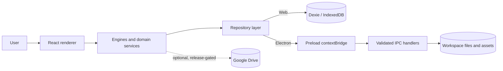
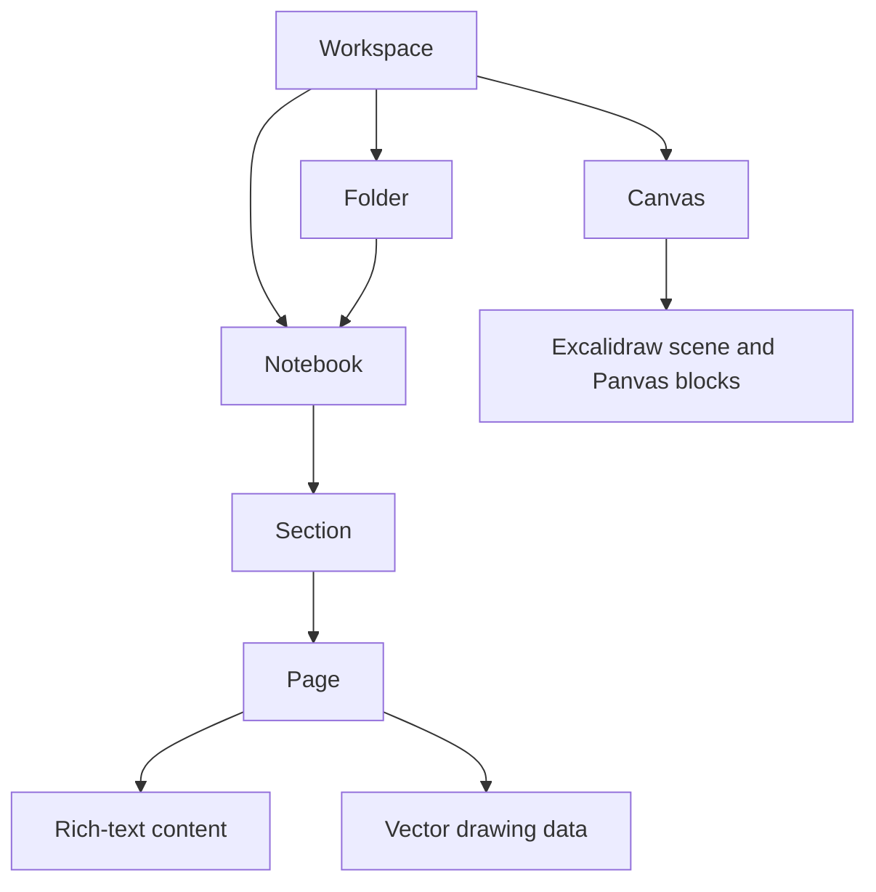
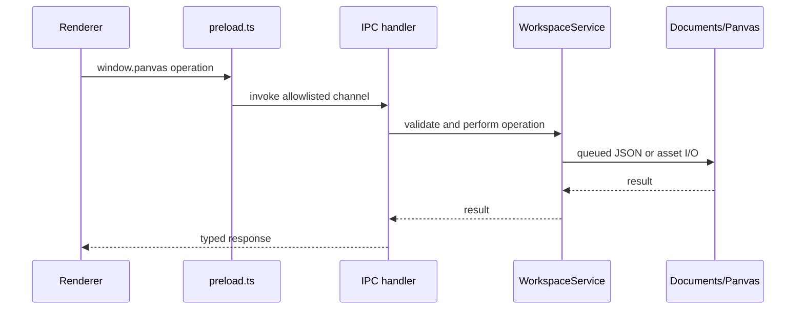

# Panvas architecture

This is the canonical high-level architecture for Panvas v0.1.0. It describes the current source tree; plans and handover notes in `docs/panvas-handover/` are historical unless this index says otherwise.

## Runtime profiles

Panvas has one React/Vite renderer with two storage profiles:

- **Windows Electron:** the main process owns filesystem and native operations. The default workspace root is `Documents/Panvas`; a user-selected storage root is persisted in Electron settings.
- **Web:** the repository layer uses origin-scoped Dexie/IndexedDB. Browser quota and site-data policies apply.
- **Cloud Sync:** Google Drive support is present behind explicit build-time feature flags and is disabled by default in v0.1.0. It is a backup/synchronization layer, not the local source of truth.

## Renderer and domain layers

- `src/components/` contains the React UI for the library, notebook, PDF workspace, canvas, settings, and public pages.
- `src/components/notebook/engine/` contains the notebook drawing/input engines. They operate on page-local vector data and should be changed with focused tests.
- `src/repositories/` presents a common data-access surface. Repositories choose Electron IPC or browser database adapters without exposing storage details to most components.
- `src/services/` contains persistence, backup, search, PDF, audio, recognition, and optional sync services.
- `src/stores/` contains Zustand state for workspace navigation, notebook settings, canvas state, UI state, and sync status.

## Notebook hierarchy

Folders can organize notebooks and canvases. A notebook is divided into sections and pages. Pages can carry rich text, drawings, page properties, and references to imported assets.

## Electron boundary

The renderer cannot use Node.js filesystem APIs directly. `electron/preload.ts` exposes the typed `window.panvas` bridge. `electron/ipc/domain-handlers.ts` and related handlers validate trusted senders and operation inputs before delegating to `WorkspaceService` or other main-process services.

## Persistence and recovery

Desktop writes are serialized by `electron/ipc/write-queue.ts`. Workspace metadata is stored in `.panvas/workspace.json`; page metadata, rich text, drawings, and canvas scenes are separate JSON payloads. Imported PDFs, images, and audio use the workspace asset stores. A last-good workspace mirror is kept under `.panvas/recovery/` for metadata recovery.

Browser persistence uses the Dexie schema in `src/database/schema.ts`. Browser and Electron adapters share domain types but do not share a filesystem.

## Recognition and PDFs

Handwriting recognition selects Windows Ink in a Windows Electron session, then a browser-native handwriting API when available. The local neural fallback infrastructure exists for evaluation but its runtime switch is off in v0.1.0; unsupported providers preserve raw ink.

PDF.js renders imported documents and `pdf-lib` supports annotated-PDF export. Both operate in the renderer/service layer; native filesystem access for desktop assets still crosses IPC.

## Security boundary

The Electron build uses context isolation, `nodeIntegration: false`, a sandboxed renderer, trusted-frame checks, and allowlisted preload methods. These are implementation controls, not a guarantee that an installation or host operating system is secure. See [SECURITY.md](../SECURITY.md) for reporting guidance and [STORAGE_AND_PERSISTENCE.md](STORAGE_AND_PERSISTENCE.md) for data handling.
