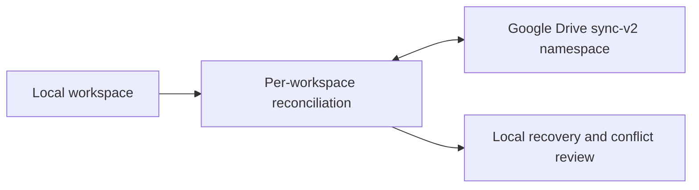

# Cloud Sync v0.1.0

> **Release-gated implementation.** Both cloud flags are false in `.env.example`; local editing does not depend on this feature.

This document records the current Google Drive sync boundary. It is not a promise that Cloud Sync is enabled in the public v0.1.0 build.

## Scope

When explicitly enabled and configured, Panvas stores a namespaced sync space in the user's Google Drive:

```text
Panvas/sync-v2/
  profile.json
  catalog.json
  workspaces/<workspace-id>/manifest.json
  objects/<sha256>
```



Local records remain the working authority. A sync failure must not block local editing or report a successful sync before the remote publication and local apply steps complete.

## Record and baseline model

Records use stable entity IDs, parent IDs, content hashes, baseline hashes, and tombstones. For each workspace, the engine compares local state, remote state, and the last trusted common baseline:

| Local vs baseline | Remote vs baseline | Result |
| --- | --- | --- |
| unchanged | unchanged | no-op |
| changed | unchanged | upload local change |
| unchanged | changed | download remote change |
| changed | changed | preserve recovery data and surface a conflict |

Objects are uploaded and verified before manifests are published. A catalog update follows manifest publication. A failed workspace is reported independently so another workspace can still complete.

## New and returning devices

An empty device with a verified account can hydrate the remote hierarchy in dependency order: workspace, folders, notebooks, sections, pages/canvases, payloads, and assets. A returning device keeps local recovery data before applying a proven remote replacement. Stable IDs, not display names or device IDs, determine ownership.

For an explicit local reset, use [CLOUD_SYNC_DEVICE_RESET.md](CLOUD_SYNC_DEVICE_RESET.md). Reset removes this device's local replica and sync metadata after creating a recovery copy; it does not delete Drive objects, account state, or OAuth credentials.

## Conflicts and recovery

The review surface offers **Use Google Drive**, **Use this device**, or **Keep both**. Recovery bytes are retained before replacement. Ambiguous or invalid workspace graphs are quarantined rather than merged by guesswork, and unrelated workspaces continue independently.

## Security and diagnostics

Electron OAuth tokens stay in the main process; browser GIS tokens are memory-only. IPC and renderer diagnostics use allowlisted, redacted fields and must not include payload text, tokens, or local paths. OAuth is loopback-based for Electron and requires explicit provider configuration.

## Limitations

- Cloud Sync is disabled by default (`VITE_ENABLE_CLOUD_SYNC=false`, `VITE_PANVAS_SYNC_V2=false`).
- OneDrive is not implemented.
- Genuine simultaneous edits require an explicit conflict decision.
- A remote graph or object that cannot be proven is kept for recovery and may require later repair.
- Existing legacy sync data is not silently migrated or deleted by the v2 namespace.

Changes to this subsystem, migrations, or OAuth require architectural review and focused tests. See [SYSTEM_DESIGN.md](SYSTEM_DESIGN.md) and [TESTING.md](TESTING.md).
