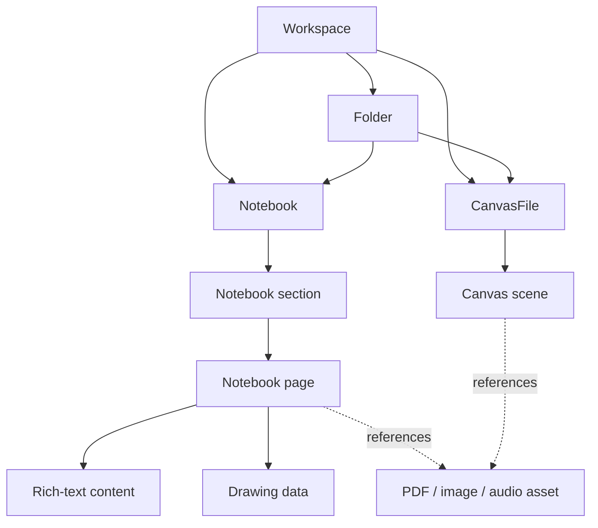

# Panvas data model

This is the canonical v0.1.0 overview of Panvas entities. TypeScript definitions in `src/types/` and the database schema are the source of truth when this document and code differ.

## Hierarchy

- A **workspace** is the top-level local container.
- A **folder** optionally organizes notebooks and canvas files.
- A **notebook** contains ordered sections and pages.
- A **page** has metadata and can reference rich-text content, vector drawing data, and imported assets.
- A **canvas file** stores an Excalidraw scene and Panvas custom blocks.

The browser schema also stores sync journals, search/index data, and binary records needed by the browser adapter. Those tables are implementation details, not additional user-facing hierarchy levels.

## Identifiers and relationships

Entities use stable string IDs generated by the application. Parent IDs link folders, notebooks, sections, pages, and canvas files to their owners. Display names are not identity keys. This matters for filesystem paths, backup imports, and optional sync.

## Page content

Page metadata includes title, ordering, deletion state, and page-property overrides. Rich text is stored as a structured TipTap/ProseMirror JSON document. Drawing data contains vector strokes and other page objects such as shapes, text, images, sticky notes, layers, and audio references. A PDF page uses a PDF data identifier and its annotation state rather than rewriting the source PDF during ordinary editing.

## Canvas content

Canvas metadata identifies the canvas and its optional parent relationships. The scene payload contains Excalidraw elements, app state, embedded files, and Panvas custom blocks (for example, markdown, LaTeX, PDF, or media blocks). The repository keeps scene data separate from metadata.

## Deletion and recovery

Delete operations normally mark records for trash so the library can restore them. Permanent deletion is an explicit operation and removes associated payloads/assets according to the owning repository. Desktop metadata recovery uses a last-good mirror; backup export/import is the portable recovery path.

## Storage-specific representation

- **Electron:** workspace metadata and page/canvas JSON live under the configured workspace directory; binary assets live in its asset stores.
- **Web:** equivalent records are stored in origin-scoped Dexie/IndexedDB tables.

Do not add a new persistence format or change relationship semantics without updating migrations, repositories, tests, and the storage documentation together.

Related documents: [ARCHITECTURE.md](ARCHITECTURE.md), [STORAGE_AND_PERSISTENCE.md](STORAGE_AND_PERSISTENCE.md), and [CLOUD_SYNC_V0_1_ARCHITECTURE.md](CLOUD_SYNC_V0_1_ARCHITECTURE.md).
