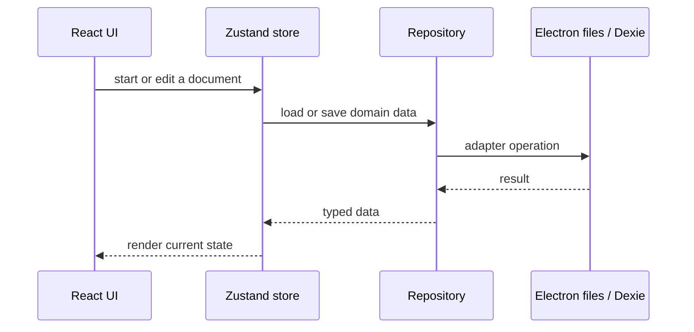

# Panvas system design

This document records the design decisions that shape the v0.1.0 codebase. It is narrower than the architecture overview: it explains the boundaries contributors should preserve.

## Design principles

1. **Local-first authority.** Ordinary editing works against local disk (Electron) or origin-scoped IndexedDB (web). Network services are optional and must not be required to open or edit local work.
2. **Repository boundary.** Components call repositories and services rather than choosing a storage API. The repository selects the Electron or browser adapter.
3. **Separate document and application appearance.** Shell themes are UI state. Page paper, grid, margins, and ink settings are document state and must not be changed by a theme switch.
4. **Durable writes.** Desktop persistence is queued and written through temporary files before replacement. Recovery data is kept separately from the primary manifest.
5. **Least privilege in Electron.** Privileged work belongs in the main process. The renderer receives only the operations exposed by the preload bridge.

## Startup and editing flow

Electron bootstraps a workspace snapshot before loading detailed page/canvas payloads. Browser startup initializes the Dexie schema. A deferred legacy Dexie-to-filesystem migration may run in Electron; it preserves the source data when migration cannot complete.

## Data ownership

The workspace hierarchy and page/canvas payloads are owned by Panvas repositories. Imported PDFs, images, and audio are stored as binary assets with metadata references. The UI may cache data in memory, but caches are not a second authority.

## Desktop persistence

`WorkspaceService` resolves the default root as `app.getPath('documents')/Panvas` and accepts a validated user-selected root. `write-queue.ts` serializes writes and uses temporary files and replacement operations. On metadata read failure, the service can fall back to `.panvas/recovery/workspace.last-good.json`.

## Browser persistence

The browser profile uses Dexie tables defined in `src/database/schema.ts`. IndexedDB is scoped to the site origin and browser profile. A browser profile is therefore not a portable workspace by itself; use Panvas backup/export flows when moving or protecting data.

## Optional sync boundary

Google Drive sync is an explicit, release-gated integration. The flags `VITE_ENABLE_CLOUD_SYNC` and `VITE_PANVAS_SYNC_V2` are both false in the example environment. Sync code compares stable records and baselines, but local stores remain authoritative and a sync failure must not block local editing. Treat changes to sync, migrations, and OAuth as architectural work requiring review.

## Change guidance

Contributors should prefer a small change at the narrowest layer that owns the behavior. Add a regression test before changing an engine or storage contract. Avoid coupling React components directly to filesystem paths, browser globals, or cloud provider details.

For entity and file details see [DATA_MODEL.md](DATA_MODEL.md) and [STORAGE_AND_PERSISTENCE.md](STORAGE_AND_PERSISTENCE.md). For test entry points see [TESTING.md](TESTING.md).
