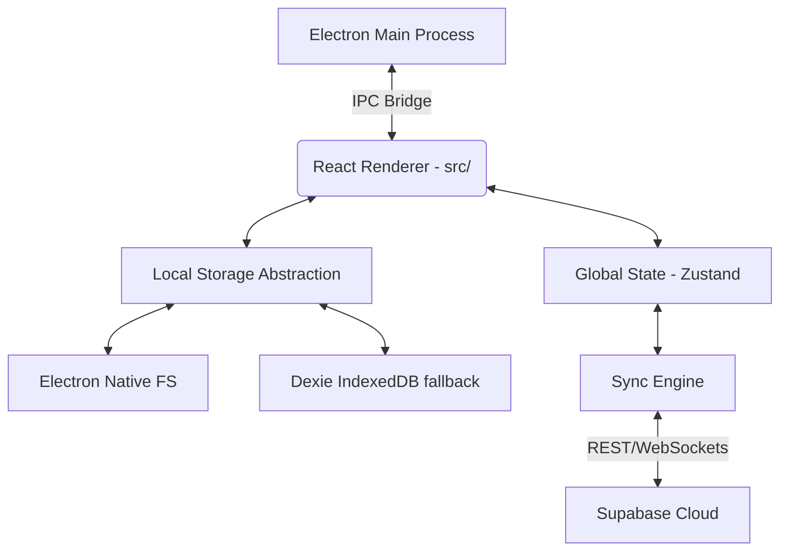

# App Architecture

This document describes the high-level architecture of Panvas, outlining how the different layers interact to deliver a local-first, infinite-canvas notebook.

## High-Level Topology

Panvas uses a hybrid architecture designed to run flawlessly as a local desktop app (via Electron) while retaining the ability to sync to the cloud (via Supabase).

### 1. The Native Layer (Electron Main)
When running as a desktop app, the Electron main process (`electron/main.ts`) serves as the host. It provides:
- **Direct File System Access**: Via IPC handlers in `electron/ipc/domain-handlers.ts`.
- **Atomic Writes**: Uses `electron/ipc/write-queue.ts` to prevent corruption from cloud-sync engines like OneDrive.
- **Window Management**: Custom frameless windows with traffic light controls.

### 2. The Presentation Layer (React + Vite)
The UI is built with React and rendered entirely on the client side. 
- **`App.tsx`**: The root component. Handles routing using `wouter`, initializes global stores, and checks for authentication.
- **Layout Shell**: `AppShell.tsx` wraps the application in a consistent layout with a sidebar, top bar, and main content area.

### 3. The Core Engines
Instead of relying on heavy React renders for the canvas, Panvas separates the UI from the rendering engine:
- **NotebookEngine (`src/components/notebook/engine`)**: A pure TypeScript class-based engine. It handles:
  - `ViewportManager`: Infinite canvas math, panning, zooming.
  - `DrawingEngine`: High-performance WebGL/2D canvas rendering.
  - `InputManager`: Translates raw PointerEvents into drawing strokes, selections, or text editing.
- **Tiptap Integration**: Floating rich text editors are overlaid on top of the WebGL/Canvas layer, positioned using `ViewportManager` coordinates.

### 4. Data Access & Persistence
Panvas is "Local-First". All reads and writes go to local storage immediately.
- **Repositories (`src/repositories`)**: Abstractions (e.g., `WorkspaceRepository.ts`) that route data requests to the correct storage mechanism.
- **Storage Strategy**:
  - In Electron: Repositories use `window.electron` to write directly to JSON files on the native filesystem.
  - In Browser: Repositories fall back to `Dexie.js` (`src/database/canvasDB.ts`) to store data in IndexedDB.

### 5. State Management
Zustand is used for reactive UI state that spans multiple components.
- `workspaceStore`: Manages the loaded notebooks and the currently active page.
- `layoutStore`: Controls UI panels, themes, and sidebar visibility.

### 6. Background Synchronization
A completely decoupled sync system ensures data safety without blocking the UI.
- `SyncScheduler.ts`: Periodically checks for dirty local records.
- `SyncEngine.ts`: Pulls/pushes delta changes to Supabase when online.
