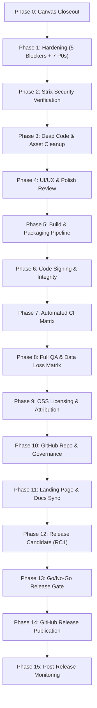

# Panvas V1 Master Release Execution Plan

> **Document Type**: Authoritative Release Master Plan  
> **Source of Truth**: [`RELEASE_HARDENING_BACKLOG.md`](RELEASE_HARDENING_BACKLOG.md)  
> **Execution Plan**: [`V1_HARDENING_EXECUTION_PLAN.md`](V1_HARDENING_EXECUTION_PLAN.md)  
> **Date**: September 10, 2026  
> **Status**: ACTIVE / SOURCE OF TRUTH FOR V1 RELEASE  
> **Target Release Window**: Standard Release Gate Progression  

---

## 1. Executive Summary & Scope Contract

This document is the **authoritative master execution plan** for transitioning Panvas from its current development state to a public, production-grade **V1 Open-Source Release**.

Panvas is an open-source, local-first digital research and note-taking workspace combining vector inking, rich text document editing, native PDF annotation, and an infinite visual canvas.

### 1.1 Scope Boundary: Three-Generation Product Evolution

To ensure Panvas ships with uncompromising stability, data integrity, and security, product development is strictly partitioned into three distinct horizons:

```
┌─────────────────────────────────┐   ┌─────────────────────────────────┐   ┌─────────────────────────────────┐
│            PANVAS V1            │   │            PANVAS V2            │   │            PANVAS V3            │
│     FOUNDATION + RELIABILITY    │──▶│         KNOWLEDGE CANVAS        │──▶│   EXTENSIBILITY + INTELLIGENCE  │
│                                 │   │                                 │   │                                 │
│ • 5-Tier Document Hierarchy     │   │ • Structured Content Blocks     │   │ • Embedded Web Research Browser │
│ • 2D Vector Ink Engine          │   │ • Technical Code & LaTeX Cards  │   │ • Model Context Protocol (MCP)  │
│ • PDF Workspace & In-Place Ink  │   │ • Document Frames on Canvas     │   │ • Sandboxed Extension Runtime   │
│ • Excalidraw Freeform Canvas    │   │ • Page & Section Backlinks      │   │ • Private Local / Hybrid AI     │
│ • Atomic WriteQueue & Storage   │   │ • Planning Cards & Board Layouts│   │ • Autonomous Agent Pipelines    │
└─────────────────────────────────┘   └─────────────────────────────────┘   └─────────────────────────────────┘
```

> [!IMPORTANT]
> **Strict Feature Freeze**: No post-V1 features (Knowledge Canvas, Embedded Web browser, MCP, Extension Platform, Panvas AI) will be introduced or accepted into the V1 release branch. All active development must focus exclusively on hardening, data integrity, bug remediation, test verification, packaging, and open-source release collateral.

---

## 2. Current Codebase State & Pre-Release Baseline

A comprehensive engineering audit of the Panvas codebase established the baseline health:

| Metric / Domain | Baseline Status | Notes / Reference |
|---|---|---|
| **Core Architecture** | **STRONG** | Clean Electron IPC boundary (`window.panvas`), Repository abstraction layer, Zustand state isolation. |
| **Canvas Subsystem** | **HARDENED** | Excalidraw 0.17.6 integration cleaned, CSP evaluated, UI modernized. Ref: [`CANVAS_V1_HARDENING.md`](CANVAS_V1_HARDENING.md). |
| **Release Blockers** | **5 BLOCKERS IDENTIFIED** | Must be remediated before release gate exit. Ref: [`RELEASE_HARDENING_BACKLOG.md`](RELEASE_HARDENING_BACKLOG.md). |
| **High Priority Bugs (P0)** | **7 P0 ITEMS IDENTIFIED** | Critical data safety, atomic writes, and process lifecycle fixes. |
| **P1 & P2 Items** | **16 ITEMS IDENTIFIED** | 11 P1 items (cleanup, tests) + 5 P2 items (packaging, a11y, typography). |
| **Verified Fixed Baseline** | **2 ITEMS VERIFIED** | `HARDEN-009` (CSP connect-src) and `HARDEN-012` (Lazy-loaded canvas bundle). |
| **Security Surface** | **STRIX PLAN READY** | Automated & dynamic penetration testing plan established. Ref: [`STRIX_SECURITY_PLAN.md`](STRIX_SECURITY_PLAN.md). |
| **Licensing / OSS** | **UNCONFIGURED** | Missing root `LICENSE`, `package.json` `"license"` unset, attribution notices needed. |

### The 5 Release Blockers (Must Be Fixed First)

1. **`HARDEN-001` (Data Loss / Migration)**: `src/lib/migration.ts` Dexie-to-FS migration script omits TipTap rich text JSON content, native ink stroke drawings, and binary attachments.
2. **`HARDEN-002` (Browser Persistence)**: `src/database/schema.ts` lacks `navigator.storage.persist()` registration on startup, exposing browser notes to eviction under disk pressure.
3. **`HARDEN-003` (Split-Brain Sync UI)**: `src/components/layout/StatusBar.tsx` binds to legacy quarantined Supabase `syncStore` rather than active Google Drive `cloudSyncStore`, showing incorrect sync status.
4. **`HARDEN-004` (Legal & Licensing)**: Missing root `LICENSE` (MIT), missing `"license": "MIT"` in `package.json`, and missing `THIRD_PARTY_NOTICES.md` acknowledging Excalidraw and bundled open-source packages.
5. **`HARDEN-005` (IPC Security Boundary)**: `electron/ipc/cloudsync-handlers.ts` lacks sender validation on IPC invocations, allowing unverified frames to trigger sync and cloud authentication actions.

---

## 3. Master Execution Sequence (Phases 0 – 15)

The path to release is structured into 16 linear, verifiable phases. No phase may be marked complete without meeting its exit criteria.



---

### Phase 0: Canvas Closeout & Runtime Verification
- **Objective**: Validate active Excalidraw 0.17.6 integration in runtime with custom LaTeX, Mockup, PDF, and Sticky Note blocks.
- **Actions**:
  - Verify canvas creation, loading, zooming, panning, and element manipulation.
  - Verify embedded image saving and local stroke persistence.
  - Confirm `HARDEN-012` (dynamic code-splitting) and `HARDEN-009` (CSP allowance) remain functional.
- **Exit Criteria**: Canvas passes all checks without unhandled console errors or memory leaks.

### Phase 1: Security & Storage Hardening (Fix Blockers & P0s)
- **Objective**: Resolve all 5 BLOCKER and 7 P0 issues in [`RELEASE_HARDENING_BACKLOG.md`](RELEASE_HARDENING_BACKLOG.md).
- **Actions**:
  - `HARDEN-001`: Complete TipTap, vector drawing, and binary attachment Dexie-to-FS migration.
  - `HARDEN-002`: Add `navigator.storage.persist()` grant on boot.
  - `HARDEN-003`: Rewire `StatusBar.tsx` to `cloudSyncStore` and deprecate legacy Supabase sync.
  - `HARDEN-004`: Add root `LICENSE` (MIT), update `package.json`, author `THIRD_PARTY_NOTICES.md`.
  - `HARDEN-005`: Enforce `requireTrustedSender` across all cloudsync IPC channels.
  - P0 Items: Atomic binary writes (`HARDEN-006`), OneDrive lock retry backoff (`HARDEN-007`), NotebookEngine unmount cleanup (`HARDEN-008`), OAuth path fallback (`HARDEN-010`), full migration integration test (`HARDEN-017`), single-roundtrip PDF page creation (`HARDEN-026`), and writeQueue flush on quit (`HARDEN-027`).
- **Exit Criteria**: All 5 BLOCKERs and 7 P0s verified with unit tests and manual reproduction.

### Phase 2: Strix Security Verification
- **Objective**: Execute automated and dynamic security auditing following [`STRIX_SECURITY_PLAN.md`](STRIX_SECURITY_PLAN.md).
- **Actions**:
  - Run static AST scans across `electron/ipc/`.
  - Execute path traversal and arbitrary protocol injection sweeps.
  - Audit Electron webPreferences (`contextIsolation: true`, `nodeIntegration: false`, `sandbox: true`).
  - Verify Content Security Policy headers in `index.html`.
- **Exit Criteria**: Zero HIGH or CRITICAL security vulnerabilities.

### Phase 3: Dead Code & Asset Cleanup
- **Objective**: Execute [`CODEBASE_CLEANUP_PLAN.md`](CODEBASE_CLEANUP_PLAN.md) to eliminate vibe-code bloat.
- **Actions**:
  - `HARDEN-014`: Delete 14 obsolete marketing prototype files (2,306 LOC).
  - `HARDEN-015`: Delete dead prototype `ViewportEngine.ts`.
  - `HARDEN-016`: Purge tracked build artifacts and screenshots from Git index.
  - `HARDEN-028`: Verify Discord RPC configuration with owner.
  - `HARDEN-029`: Remove dead Supabase imports from stores.
- **Exit Criteria**: Zero unreferenced prototype files; clean git status after building.

### Phase 4: UI/UX & Ergonomic Polish
- **Objective**: Finalize core user experience and visual polish.
- **Actions**:
  - `HARDEN-013`: Replace synchronous `window.confirm()` with custom `ConfirmDialog`.
  - `HARDEN-023`: Add accessible `aria-label` attributes to icon-only buttons.
  - `HARDEN-022`: Bundle local handwriting fonts (*Virgil*, *Caveat*, *Kalam*) for 100% offline typography.
  - `HARDEN-030`: Add error boundaries around core viewport components.
- **Exit Criteria**: UI feels responsive, accessible, and polished.

### Phase 5: Build & Packaging Pipeline
- **Objective**: Ensure reproducible, production-grade desktop and web builds.
- **Actions**:
  - `HARDEN-021`: Generate multi-resolution `icon.ico` for Windows packaging.
  - Configure `electron-builder` for NSIS installer generation.
  - Verify production build bundle sizes and code-splitting.
- **Exit Criteria**: `npm run package:win` builds clean installer without warnings.

### Phase 6: Code Signing & Release Asset Integrity
- **Objective**: Sign or document release artifacts and generate checksums.
- **Actions**:
  - Obtain owner decision on Authenticode signing (`HARDEN-021`).
  - Generate SHA-256 checksums for all release binaries.
  - Author `SHA256SUMS.txt` manifest.
- **Exit Criteria**: Verifiable checksum manifest matching build outputs.

### Phase 7: Automated CI Matrix (GitHub Actions)
- **Objective**: Establish automated verification on pull requests and commits.
- **Actions**:
  - Scaffold `.github/workflows/ci.yml` (Typecheck + Lint + Test).
  - Scaffold `.github/workflows/release.yml` (Tagged release packaging).
- **Exit Criteria**: CI pipeline passes on release branch.

### Phase 8: Full QA & Data Loss Matrix
- **Objective**: Execute the complete test matrix specified in [`V1_FINAL_QA_MATRIX.md`](V1_FINAL_QA_MATRIX.md).
- **Actions**:
  - Execute 16 functional test suites across Electron and Web/PWA.
  - Stress test sudden power loss, process termination, and large document imports.
  - Validate Google Drive sync across two devices.
- **Exit Criteria**: 100% of P0/P1 test cases PASS; zero data loss occurrences.

### Phase 9: OSS Licensing & Attribution
- **Objective**: Establish legal compliance and third-party attribution following [`OSS_GITHUB_RELEASE_PLAN.md`](OSS_GITHUB_RELEASE_PLAN.md).
- **Actions**:
  - Place MIT `LICENSE` in repository root.
  - Publish `THIRD_PARTY_NOTICES.md` acknowledging Excalidraw, KaTeX, PDF.js, and dependencies.
- **Exit Criteria**: Clean legal review and valid SPDX license identifiers.

### Phase 10: GitHub Repo & Governance
- **Objective**: Prepare repository for community contribution.
- **Actions**:
  - Verify `README.md`, `CONTRIBUTING.md`, `SECURITY.md`, and `CODE_OF_CONDUCT.md`.
  - Configure issue templates and discussion categories.
- **Exit Criteria**: Public repository ready for welcoming open-source contributors.

### Phase 11: Landing Page & Documentation Sync
- **Objective**: Align public marketing portal with actual V1 reality.
- **Actions**:
  - Ensure landing page highlights V1 capabilities (Vector ink, Rich text, PDF workspace, Canvas, Google Drive).
  - Strictly omit advertising deferred post-V1 features (MCP, in-app browser, AI).
- **Exit Criteria**: Truthful marketing claims matching V1 functionality.

### Phase 12: Release Candidate (RC1)
- **Objective**: Tag and freeze release candidate for final smoke testing.
- **Actions**:
  - Tag `v1.0.0-rc.1` in Git.
  - Perform clean-environment installation test on fresh Windows machine.
- **Exit Criteria**: Zero regressions discovered during RC testing.

### Phase 13: Go/No-Go Release Gate
- **Objective**: Formal sign-off against the 13 criteria of the Definitive V1 Release Gate.
- **Actions**:
  - Verify all 5 BLOCKERs and 7 P0s are closed.
  - Verify test suite passes (505+ passing tests).
  - Obtain stakeholder sign-off.
- **Exit Criteria**: Unanimous GO decision.

### Phase 14: GitHub Release Publication
- **Objective**: Publish release artifacts to the public.
- **Actions**:
  - Draft GitHub Release for `v1.0.0`.
  - Attach `Panvas-Setup-1.0.0.exe`, portable archives, and `SHA256SUMS.txt`.
  - Publish release and release notes.
- **Exit Criteria**: Release live on GitHub with downloadable binaries.

### Phase 15: Post-Release Monitoring
- **Objective**: Monitor early adopter feedback and crash reports.
- **Actions**:
  - Monitor GitHub Issues for installation or data persistence bugs.
  - Triage community feedback against V1 fixes vs post-V1 roadmap items.
- **Exit Criteria**: Stable v1.0.0 release in the wild.

---

## 4. Related Release Documents

- Live Action Checklist: [`V1_RELEASE_CHECKLIST.md`](V1_RELEASE_CHECKLIST.md)
- Complete QA Test Matrix: [`V1_FINAL_QA_MATRIX.md`](V1_FINAL_QA_MATRIX.md)
- Hardening Work Packages: [`V1_HARDENING_EXECUTION_PLAN.md`](V1_HARDENING_EXECUTION_PLAN.md)
- Open Source & GitHub Release Plan: [`OSS_GITHUB_RELEASE_PLAN.md`](OSS_GITHUB_RELEASE_PLAN.md)
- Pre-Release Engineering Audit: [`PRE_RELEASE_ENGINEERING_AUDIT.md`](PRE_RELEASE_ENGINEERING_AUDIT.md)
- Release Hardening Backlog: [`RELEASE_HARDENING_BACKLOG.md`](RELEASE_HARDENING_BACKLOG.md)
- Strix Security Plan: [`STRIX_SECURITY_PLAN.md`](STRIX_SECURITY_PLAN.md)
- Canvas Hardening Handoff: [`CANVAS_V1_HARDENING.md`](CANVAS_V1_HARDENING.md)
- V1 Feature Scope Contract: [`V1_FEATURE_SCOPE.md`](V1_FEATURE_SCOPE.md)
- Future Engineering Reference: [`V2_ROADMAP.md`](V2_ROADMAP.md)
- Master Product Roadmap: [`docs/ROADMAP.md`](../ROADMAP.md)
